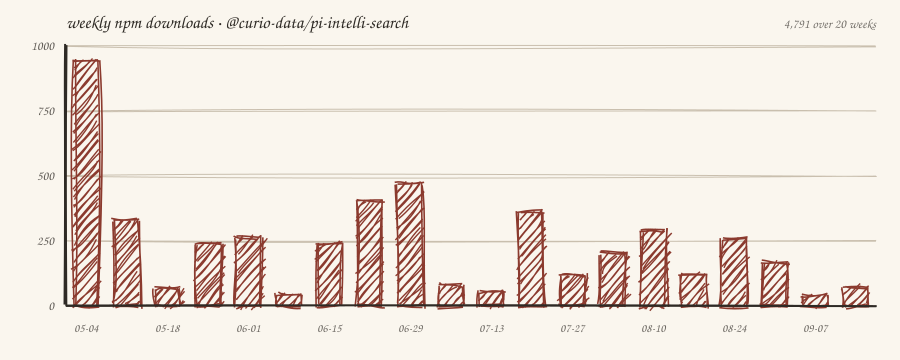

# pi-intelli-search

[](https://www.npmjs.com/package/@curio-data/pi-intelli-search)
[](https://www.npmjs.com/package/@curio-data/pi-intelli-search)
[](https://github.com/earendil-works/pi)
[](./LICENSE)


Intelligent web research for [`Pi`](https://github.com/earendil-works/pi): search, extract, collate, and cache grounded web context in one tool call.

A `Pi` extension for deep web research. It searches via a search-grounded model ([_Perplexity Sonar_](https://docs.perplexity.ai) by default), merges every source the model cited, fetches pages through a dual-fetch comparison ([_Defuddle_](https://github.com/kepano/defuddle) versus Markdown endpoint), extracts query-relevant content per page with a dedicated LLM guided by a _focused prompt_, then collates findings: deduplicating, flagging inconsistencies, and synthesising a concise summary. Everything is cached in `.search/` for offline reuse. Cache suggest surfaces related previous searches on each query.

<p align="center">
  
</p>

**Features:**

- 🔍 **Search:** a search-grounded model, [_Perplexity Sonar_](https://docs.perplexity.ai) via [_OpenRouter_](https://openrouter.ai) by default. One API key, no $50 minimum. Any OpenRouter chat model works too via the [web search server tool](#openrouter-web-search-server-tool).
- 🔗 **Harvest:** every source the search model cited, not only the links it wrote into the answer. Machine-readable `url_citation` annotations are merged with text links before pages are selected.
- 🌐 **Fetch:** Dual-fetch each page (HTML → Defuddle versus Markdown endpoint), compare quality, pick the cleaner version.
- 📄 **Extract:** Per-page LLM extraction guided by a _focused prompt_. Compresses ≈50K to ≈3-5K chars of query-relevant content.
- 🔗 **Collate:** Cross-source deduplication, inconsistency detection, and synthesis into a focused ≈5K summary.
- 💾 **Cache:** Persistent `.search/` cache with automatic cache suggest. Related previous searches surfaced on each query.
- 🎯 **Configurable:** Swap any pipeline stage (search, extract, collate) to any model `Pi` supports.
- 💰 **Low cost:** Approximately $0.06 per research session with default settings.

> **Search model advisory (2026-09).** Perplexity retires the Sonar Chat Completions endpoints on **2026-09-27**. Whether the `openrouter/perplexity/sonar` route survives that date is up to [OpenRouter](https://openrouter.ai), which has published no statement. Two supported configurations do not depend on that route, and both are settings-only changes: [the web search server tool](#openrouter-web-search-server-tool) (any OpenRouter chat model, from ≈$0.008 per search) and [`perplexity/sonar-pro-search`](#choosing-an-alternative-search-configuration) (drop-in model swap, ≈$0.05 per search). The default is unchanged in v0.13.0.

## Launch Blog Post

<p align="center">
  <a href="https://blog.curiodata.pro/posts/22-pi-intelli-search/">
    
  </a>
</p>

Read the launch post, [_pi-intelli-search: LLM-Native Web Research for the Pi Coding Agent_](https://blog.curiodata.pro/posts/22-pi-intelli-search/), for the design story behind the pipeline: why per-page LLM extraction beats raw page dumps, how collation keeps the agent context clean, and a full cost breakdown at ≈$0.05 per session.

## What It Adds Over Other Extensions

<p align="center">
  
</p>

*The comparison illustration shows the default configuration and cost at its creation; search is configurable (see [Model Configuration](#model-configuration)).*

Four capabilities together separate `intelli-search` from every other extension in the `Pi` ecosystem:

1. **Dual-fetch quality comparison.** Every page is fetched twice in parallel (Defuddle versus Markdown endpoint), scored, and the better version wins. Server-rendered Markdown is not guaranteed to be cleaner than HTML; the comparison catches this automatically.
2. **Per-page LLM extraction guided by `focusPrompt`.** Each page is compressed to ≈3-5K chars of query-relevant content before entering the agent's context. Extraction quality scales with the chosen model.
3. **LLM collation with deduplication.** A collation model synthesises across sources, flags conflicting claims, and preserves source attribution. The agent does not spend reasoning tokens on mechanical synthesis.
4. **Persistent cache with cache suggest.** Full pages and extractions are kept in `.search/` and indexed. An LLM judge surfaces related previous searches on each query, so follow-up research is faster and cheaper.

The agent receives a concise ≈5K summary by default. The full page content stays in the cache, accessible via native `Pi` tools like `read` or `grep` for deeper inspection. No other `Pi` search extension offers both.

For the detailed feature-by-feature comparison against six other `Pi` search extensions, see [docs/COMPARISON.md](docs/COMPARISON.md).


## Install

### Prerequisites

You need at minimum an [OpenRouter](https://openrouter.ai) account: one key covers the default search model ([_Perplexity Sonar_](https://docs.perplexity.ai)) plus extraction and collation with the default models, and every [alternative search configuration](#choosing-an-alternative-search-configuration) uses the same account. For the extract and collate stages, any model or provider `Pi` supports can be used. See [Model Configuration](#model-configuration) for how to swap them.

1. **Sign in with OAuth (recommended):** run `/login openrouter` in `Pi`. On `Pi` 0.82.0 and later this performs OpenRouter OAuth PKCE sign-in and stores a user-controlled key automatically. No manual key paste is required.
2. **Or add a key manually:** create one at [openrouter.ai/keys](https://openrouter.ai/keys), then edit `~/.pi/agent/auth.json`:

```json
{
  "openrouter": {
    "type": "api_key",
    "key": "sk-or-v1-..."
  }
}
```

### Install the Extension

From `npm` (recommended):

```bash
pi install npm:@curio-data/pi-intelli-search
```

From _GitHub_:

```bash
pi install git:github.com/Curio-Data/pi-intelli-search
```

Local development:

```bash
pi install /path/to/pi-intelli-search
```

On first load, `Pi` will show `Added models:` followed by whatever was missing: on a fresh install that is `perplexity/sonar`, `perplexity/sonar-pro`, and `perplexity/sonar-pro-search`; an upgrade from an earlier version lists only the models you did not already have. If your OpenRouter key is missing, you will see a warning notification.

### Verify Installation

Start `Pi` and type `/model`. You should see `perplexity/sonar`, `perplexity/sonar-pro`, and `perplexity/sonar-pro-search` in the model list. If they are missing after a manual edit, reopen `/model`: since `Pi` 0.82.0 the picker reloads `models.json` on open. Restart `Pi` only if they are still absent. Registration does not select a pipeline model; `searchModel` in settings does that.

### Customise (Optional)

No configuration is needed to get started. The defaults use OpenRouter for all stages. If you want to change models, add a `pi-intelli-search` block to `~/.pi/agent/settings.json` or, for a trusted project, `<project>/.pi/settings.json`:

**Defaults (what you get without any config):**

Copying this block pins every value explicitly, which also opts you out of future default migrations. You do not need to write any of this: the table in [Settings Reference](#settings-reference) is the complete list of keys.

```jsonc
{
  "pi-intelli-search": {
    "searchModel": {
      "provider": "openrouter",
      "model": "perplexity/sonar"
    },
    "searchWebSearch": {
      "enabled": false,
      "engine": "auto",
      "maxResults": 8,
      "reasoning": "minimal"
    },
    "extractModel": {
      "provider": "openrouter",
      "model": "minimax/minimax-m2.7"
    },
    "collateModel": {
      "provider": "openrouter",
      "model": "minimax/minimax-m2.7"
    },

    "defaultUrls": 10,
    "maxUrls": 20,
    "cacheDir": ".search",
    "extractMaxChars": 150000,
    "extractionConcurrency": 4,
    "extractionMaxTokens": 3000,
    "collationMaxTokens": 4000,
    "fetchTimeoutMs": 20000,
    "fetchConcurrency": 4,
    "browserFingerprint": "chrome_145"
  }
}
```

**Customised example (different provider, tuned pipeline):**

```jsonc
{
  "pi-intelli-search": {
    "searchModel": {
      "provider": "openrouter",
      "model": "perplexity/sonar"
    },
    "extractModel": {
      "provider": "openai",
      "model": "gpt-4o-mini"
    },
    "collateModel": {
      "provider": "openai",
      "model": "gpt-4o-mini"
    },

    "defaultUrls": 6,
    "maxUrls": 6,
    "cacheDir": ".my-research-cache",
    "extractMaxChars": 80000,
    "extractionMaxTokens": 8000,
    "collationMaxTokens": 16000,
    "fetchTimeoutMs": 30000,
    "fetchConcurrency": 2,
    "browserFingerprint": "chrome_145"
  }
}
```

See [Model Configuration](#model-configuration) for all options and [Settings](#settings) for the full reference.

## Tools

| Tool               | Description                                                                                         |
| ------------------ | --------------------------------------------------------------------------------------------------- |
| `intelli_search`   | Search the web and return a concise answer with a source list (top `defaultUrls`).                   |
| `intelli_extract`  | Extract query-relevant content from a web page, preserving code and technical detail verbatim.      |
| `intelli_collate`  | Deduplicate and synthesise multiple extractions into a summary. Writes cache.                       |
| `intelli_research` | Search, fetch, extract, collate, cache. The primary research tool. One call.                        |

## Quick Start

### Quick Search

```text
intelli_search(query="TypeScript 5.8 release date")
```

### Deep Research

**Always provide a `focusPrompt`.** The extraction LLM works best with specific guidance.

```text
intelli_research(
  query="Svelte 5 runes tutorial examples",
  focusPrompt="Extract the core rune concepts ($state, $derived, $effect), their syntax, and how they replace the old reactive declarations. Include migration patterns from Svelte 4."
)
```

### Targeted Research With Domain Guidance

```text
intelli_research(
  query="Cloudflare Workers KV write timeout limits",
  focusPrompt="Extract KV write limits, timeout thresholds, storage limits, and any workarounds for bulk writes. Focus on hard numbers and error messages.",
  maxUrls=3,
  domains=["developers.cloudflare.com"]
)
```

`domains` guides source selection, it is not a security boundary: the query gains a `site:` expression, and with the web search tool enabled the same domains are also combined with `searchWebSearch.allowedDomains` and sent as an engine filter. The lists are combined, not intersected, and returned URLs are not checked against a local hostname allowlist before fetching. Engine support for allow and exclude lists differs (see [searchWebSearch Keys](#searchwebsearch-keys)).

### Comparing Options

```text
intelli_research(
  query="Tailwind CSS vs Vanilla Extract comparison 2026",
  focusPrompt="Extract pros/cons, bundle size benchmarks, DX tradeoffs, and migration costs. Note which claims come from official sources vs blog opinions."
)
```

## Model Configuration

All three pipeline stages use independently configurable models. Defaults are chosen for cost-efficiency, but **any model `Pi` can access works**. This includes built-in providers, [OpenRouter](https://openrouter.ai) models, or models from other extensions.

| Stage   | Default                       | Config key              |
| ------- | ----------------------------- | ----------------------- |
| Search  | `openrouter/perplexity/sonar` | `searchModel`           |
| Extract | `openrouter/minimax/minimax-m2.7` | `extractModel`      |
| Collate | `openrouter/minimax/minimax-m2.7` | `collateModel`      |

### Why OpenRouter for _Sonar_?

[_Perplexity Sonar_](https://docs.perplexity.ai) is an excellent search-grounded model, but it is not in `Pi`'s built-in model list. Rather than requiring a separate Perplexity API account (which requires a **$50 minimum credit top-up**), the extension routes _Sonar_ through [OpenRouter](https://openrouter.ai). _OpenRouter_ is a unified pay-as-you-go API with a lower minimum spend. One API key gives you _Sonar_ alongside thousands of other models. On first load, the extension patches `~/.pi/agent/models.json` to add _Sonar_ under the `openrouter` provider so `Pi` can discover it. This approach has several benefits:

- **Avoids the Perplexity API $50 minimum.** Routing through `OpenRouter` consolidates spend on a single account already used across the open-source coding-agent ecosystem, including `Pi`. No separate _Perplexity_ subscription is required.
- **One account, many models.** The same OpenRouter key covers _Sonar_ and any other models you might want for extract or collate.
- **Is non-destructive.** The patch merges new models by ID. It never replaces existing OpenRouter models.
- **Is idempotent.** It is safe across extension reloads and updates.

- **Is idempotent.** It is safe across extension reloads and updates.

The same single-key argument covers the post-sunset alternatives: the [web search server tool](#openrouter-web-search-server-tool) and [`perplexity/sonar-pro-search`](#choosing-an-alternative-search-configuration) both route through the same OpenRouter account.

### Source Harvesting from Citations

Search-grounded models return machine-readable `url_citation` annotations naming the sources they consulted, a larger set than the links they write into the prose (probe: 20 annotations against 3 prose links from _Sonar_). `Pi`'s chat-completions adapter reassembles only text, thinking, and tool-call blocks, so those annotations never reach extension code on their own. The pipeline reads a tee of the raw response body, parses the citations out, and merges them with the text-scraped links before pages are selected for fetching.

This runs on every search call regardless of model, needs no configuration, and never blocks or fails the pipeline. Text links come first; annotation-only links follow; exact URL duplicates are removed. `intelli_research` applies its URL limit after merging, so not every discovered source is fetched. Harvesting is best-effort: a model that emits no annotations, or annotations the parser does not recognise, leaves the text-link path intact. `intelli_search` caps its rendered source list at `defaultUrls` (top 10 by default). The count is recorded in `meta.json` as `stages.search.annotationsHarvested`.

### OpenRouter Web Search Server Tool

The search stage normally relies on a search-native model (default: _Sonar_). The `searchWebSearch` setting decouples it: [OpenRouter](https://openrouter.ai)'s `openrouter:web_search` server tool gives the configured chat model access to live web search, so the pipeline is not tied to any search-native model family. The tool is beta upstream; the model decides whether and how many times to search, and search charges depend on the engine, the number of server-side searches, and token usage. `maxResults` limits results per search and `maxUrls` limits pages fetched; neither caps total search spend.

**`searchWebSearch` requires `searchModel.provider` to be `openrouter`.** The tool id is OpenRouter-specific; on any other provider the setting is ignored without warning.

A probe-validated pairing (2026-09): `openai/gpt-5-nano` with engine `exa` and `reasoning: "minimal"`, at ≈$0.008 per search with 5-17 cited sources:

```jsonc
{
  "pi-intelli-search": {
    "searchModel": {
      "provider": "openrouter",
      "model": "openai/gpt-5-nano"
    },
    "searchWebSearch": {
      "enabled": true,
      "engine": "exa",
      "maxResults": 8,
      "reasoning": "minimal"
    }
  }
}
```

#### searchWebSearch Keys

A supplied object replaces the entire default object; there is no per-key merge. A trusted project's object also replaces the global one. Omitting `reasoning` gives `low`, not `minimal`; omitting `maxResults` sends no result-count override and OpenRouter applies its own default (5).

| Key | Values | Notes |
|---|---|---|
| `enabled` | `true`, `false` | Off by default. Requires `searchModel.provider` to be `openrouter`. |
| `engine` | `auto`, `native`, `exa`, `parallel`, `perplexity`, `firecrawl` | `auto` (and unrecognised values) are omitted from the payload, leaving OpenRouter's default. |
| `maxResults` | 1-25 (1-20 on `perplexity`) | Rounded and clamped by the extension. Per engine search, not per session. |
| `searchContextSize` | `low` (≈5K chars), `medium` (≈15K), `high` (≈30K) | Engine-specific budgets; some engines ignore it. |
| `allowedDomains` | array of domains | Combined (not intersected) with the per-call `domains` tool parameter. Cannot be combined with `excludedDomains` except on `exa`. |
| `excludedDomains` | array of domains | As above. |
| `reasoning` | `minimal`, `low`, `medium`, `high` | Falls back to `low` when omitted. Use `minimal` explicitly with GPT-5 family models, which otherwise burn reasoning budget when paired with the tool. |

The extension exposes a subset of the server tool's parameters. Upstream `mode`, `max_uses`, `max_total_results`, `max_characters`, and `user_location` are not settable through this block. The `firecrawl` engine additionally requires your own Firecrawl account configured with OpenRouter (BYOK); the other engines bill through OpenRouter credits.

### Choosing an Alternative Search Configuration

Perplexity states that its Sonar API is supported until September 27, 2026 (see its [migration guide](https://docs.perplexity.ai/docs/agent-api/migrate-from-sonar/overview)). This release does not change the default search model. It adds two configurable alternatives. Check [OpenRouter](https://openrouter.ai) for current availability: the direct API sunset notice does not by itself establish the retirement date of each OpenRouter model.

| Option | Model | Setting | Cost per search |
|---|---|---|---|
| Server tool | `openai/gpt-5-nano` + `engine: "exa"` | `searchWebSearch.enabled: true` | ≈$0.008 |
| Model swap | `perplexity/sonar-pro-search` | `searchModel` only | ≈$0.05 |
| Current default | `perplexity/sonar` | none | ≈$0.007, direct API retires 2026-09-27 |

The model swap is settings-only:

```jsonc
{
  "pi-intelli-search": {
    "searchModel": {
      "provider": "openrouter",
      "model": "perplexity/sonar-pro-search"
    },
    "searchWebSearch": {
      "enabled": false
    }
  }
}
```

`perplexity/sonar-pro-search` bills $18 per 1,000 requests on top of $3/$15 per 1M tokens ([model card](https://openrouter.ai/perplexity/sonar-pro-search)). It buys agentic multi-step search; it is not the cheap migration. Explicitly disabling `searchWebSearch` in the example makes it safe to apply after previously enabling the server tool: changing `searchModel` alone does not clear that separate setting.

### Swapping the Extract and Collate Model

_MiniMax_ M2.7 (via OpenRouter) is the default because it is cheap and effective for extraction and collation. However, you can use any model `Pi` supports. Override in `~/.pi/agent/settings.json` or `.pi/settings.json`:

**Option A: Use a `Pi` Built-In Provider** (auth via `/login`):

```jsonc
{
  "pi-intelli-search": {
    "extractModel": {
      "provider": "openai",
      "model": "gpt-4o-mini"
    },
    "collateModel": {
      "provider": "openai",
      "model": "gpt-4o-mini"
    }
  }
}
```

**Option B: Use Another OpenRouter Model** (same key, no extra setup):

```jsonc
{
  "pi-intelli-search": {
    "extractModel": {
      "provider": "openrouter",
      "model": "google/gemini-2.0-flash-001"
    },
    "collateModel": {
      "provider": "openrouter",
      "model": "google/gemini-2.0-flash-001"
    }
  }
}
```

**Option C: Use a Model Provided by Another Extension** (for example, Z.Ai or local models):

```jsonc
{
  "pi-intelli-search": {
    "extractModel": {
      "provider": "zai",
      "model": "glm-5.1"
    },
    "collateModel": {
      "provider": "zai",
      "model": "glm-5.1"
    }
  }
}
```

The only requirement is that the model is registered in `Pi`'s model registry and has auth configured. Run `/login` to set up built-in providers, or follow the extension's own setup for extension-provided models.

### Model Selection Guidance

For extraction and collation, the ideal model has:

- **Low cost per token:** 8 extractions, 1 collation, and 1 cache suggest per default session.
- **Good instruction following:** Must adhere to extraction prompts precisely.
- **Sufficient context:** Cleaned pages can be ≈50K chars (truncated to `extractMaxChars`).

Models known to work well for extraction and collation: _MiniMax_ M2.7 (default, via OpenRouter), _Qwen_ 3.5-Flash (≈1M context, ≈$0.26/M output), _DeepSeek_ V4 Flash (≈1M context, ≈$0.28/M output), _Gemini_ 2.0 Flash Lite (≈1M context, ≈$0.30/M output), _GPT-4.1_ Nano (≈1M context, ≈$0.40/M output).

### Required API Keys

With default settings, you need one key in `~/.pi/agent/auth.json`:

```json
{
  "openrouter": {
    "type": "api_key",
    "key": "sk-or-v1-..."
  }
}
```

A single [OpenRouter](https://openrouter.ai) key is the minimum required. It covers the default search model (Sonar) plus MiniMax M2.7 for extraction and collation with the default models. The extract and collate stages can use any model `Pi` supports. Override `extractModel` or `collateModel` in settings to switch providers.

Run `/login openrouter` in `Pi` to authorise via OAuth (`Pi` 0.82.0 and later), or edit the file directly with a key from [openrouter.ai/keys](https://openrouter.ai/keys).

## Pipeline

<p align="center">
  
</p>

All model assignments are configurable. See [Model Configuration](#model-configuration). The illustration above shows the default configuration; alternative search configurations use the same five-stage pipeline.

The search stage merges text links with harvested citation annotations before selecting pages (see [Source Harvesting from Citations](#source-harvesting-from-citations)). Each page is dual-fetched (HTML via Defuddle versus Markdown endpoint) and scored for quality. Per-page extraction (guided by `focusPrompt`) compresses ≈50K chars to ≈3-5K of query-relevant content before collation, keeping the total context manageable (≈30-50K for 10 pages).

At the end of each run the pipeline writes a local-only `meta.json` telemetry sidecar into the cache directory (see [Cache Structure](#cache-structure)). Set `disableTelemetry: true` to suppress it.

See [docs/ARCHITECTURE.md](docs/ARCHITECTURE.md) for detailed design decisions.

## Cost

Per research session with the default 10 pages: **≈$0.06**

| Step                           | Calls            | Cost     |
| ------------------------------ | ---------------- | -------- |
| Search (_Sonar_)               | 1                | ≈$0.007  |
| Fetch (Defuddle + Markdown)    | 10 (≤4 concurrent) pairs | $0.00    |
| Extract (M2.7 via OpenRouter)       | 10 (≤4 concurrent) | ≈$0.04   |
| Collate (M2.7 via OpenRouter)       | 1                | ≈$0.005  |
| Cache suggest (M2.7 via OpenRouter) | 1                | ≈$0.0002 |

Since v0.13.0 the search stage contributes every source the model cited, not only the ones it wrote into the prose, so sessions reach the `defaultUrls` page count more often than before. The ≈$0.06 figure is the typical cost of a full 10-page session; lower `defaultUrls` to hold earlier spend. Changing the search model or engine also changes the search step's cost (see [Choosing an Alternative Search Configuration](#choosing-an-alternative-search-configuration)); the extract and collate rows scale with your chosen models.

## Settings

Override defaults in `~/.pi/agent/settings.json` or, for a trusted project, `<project>/.pi/settings.json` under the `pi-intelli-search` namespace. `Pi` ignores project-local settings until you approve the project; the global file always applies:

```jsonc
{
  "pi-intelli-search": {
    // Model assignments (see Model Configuration above)
    "searchModel": {
      "provider": "openrouter",
      "model": "perplexity/sonar"
    },
    "extractModel": {
      "provider": "openrouter",
      "model": "minimax/minimax-m2.7"
    },
    "collateModel": {
      "provider": "openrouter",
      "model": "minimax/minimax-m2.7"
    },

    // Pipeline tuning
    "defaultUrls": 10,
    "maxUrls": 20,
    "cacheDir": ".search",
    "extractMaxChars": 150000,
    "extractionMaxTokens": 3000,
    "collationMaxTokens": 4000,

    // Fetch behavior
    "fetchTimeoutMs": 20000,
    "fetchConcurrency": 4,
    "browserFingerprint": "chrome_145"
  }
}
```

### Settings Reference

| Setting | Stage | Default | What It Does |
|---|---|---|---|
| `searchModel` | 1. Search | `openrouter/perplexity/sonar` | Model for the initial web search. Swap to a stronger model for deeper search results, or to a cheaper one to reduce the ≈$0.007 search cost. See [Model Configuration](#model-configuration). |
| `searchWebSearch` | 1. Search | see [reference](#openrouter-web-search-server-tool) | Attach OpenRouter's `openrouter:web_search` server tool to the search-stage call so a plain OpenRouter chat model gains access to live search. Off by default; requires `searchModel.provider` to be `openrouter`. Full key reference in [OpenRouter Web Search Server Tool](#openrouter-web-search-server-tool). |
| `extractModel` | 3. Extract | `openrouter/minimax/minimax-m2.7` | Model for per-page content extraction. Runs 10 times per session so low cost per token matters. Ensure the model's context window exceeds `extractMaxChars` plus the system prompt. For a model with a smaller window (e.g. 256K), lower `extractMaxChars` to match. See [Model Configuration](#model-configuration). |
| `collateModel` | 4. Collate | `openrouter/minimax/minimax-m2.7` | Model for cross-source synthesis and deduplication. Sees all extractions at once so it needs enough context and instruction-following to flag contradictions. A model with ≥128K context handles 8 full extractions comfortably. See [Model Configuration](#model-configuration). |
| `defaultUrls` | 1 → 2 | `10` | Fallback when the agent does not pass `maxUrls` per call; also caps `intelli_search`'s rendered source list. Lower values reduce cost and latency but give less thorough results. The agent's [skill guide](skills/intelli-search/SKILL.md) recommends 3 (targeted), 10 (broad), or 16 (exhaustive). Raised from 8 in v0.13.0: citation harvesting fills the URL list, so the pipeline can use more sources than prose links alone provided. |
| `maxUrls` | 1 → 2 | `20` | Hard cap on URLs fetched. Lower caps mean faster responses and lower cost; higher caps allow more thorough research. Each extra URL adds roughly $0.004 in extract cost with the default model. Requests above the cap are silently clamped. Raised from 16 in v0.13.0. |
| `cacheDir` | 4, 5 | `.search` | Directory where research sessions are cached. Change this to keep project-specific research separate. Example: `".my-research-cache"`. |
| `extractMaxChars` | 3. Extract | `150000` | Maximum characters of raw page content fed to the extract LLM per page. **Lower this when using an extract model with a small context window** (e.g. 256K) to prevent context overflow. Raise it if pages are truncated and your model has ample headroom. Each 50K chars consumes roughly 12K input tokens. |
| `extractionConcurrency` | 3. Extract | `4` | Number of per-page extractions sent to the extract model simultaneously. Bounded so a wide result set does not fire many concurrent LLM calls and trigger rate limiting. Raise it (6-8) on generous rate limits for faster extraction; lower it (1-2) on tight limits. |
| `extractionMaxTokens` | 3. Extract | `3000` | Maximum output tokens for each per-page extraction. Higher values preserve more detail at higher cost. **Lower this when using a model with a small context window** so the output does not crowd out the input. The extract prompt targets 3,000-5,000 characters; 3,000 tokens covers this comfortably. |
| `collationMaxTokens` | 4. Collate | `4000` | Maximum output tokens for the final synthesis. Lower values force tighter deduplication. **Lower this when using a collation model with a small context window** (the output must fit alongside all extraction inputs). The summary you see in the agent context is bounded by this setting. |
| `fetchTimeoutMs` | 2. Fetch | `20000` | Per-page fetch timeout in milliseconds. Increase if you research sites known to be slow. Fetches run in parallel so this does not multiply by page count. |
| `fetchConcurrency` | 2. Fetch | `4` | Number of pages fetched simultaneously. Higher values (6-8) complete the fetch stage faster but may trigger rate limiting. Lower values (2) are gentler on target servers. |
| `browserFingerprint` | 2. Fetch | `chrome_145` | TLS fingerprint used by [_wreq-js_](https://github.com/sqdshguy/wreq-js) to impersonate a browser. Determines which HTTP client signature site sees. Available profiles include `chrome_*`, `firefox_*`, `safari_*`, `edge_*`, and `opera_*` across many versions. Change this if a site blocks the default fingerprint. |
| `llmTimeoutMs` | All LLM | `90000` | Hard per-call timeout in milliseconds for every LLM request. Bounds a stalled provider connection (common under rate limiting) so it becomes a retryable timeout instead of hanging on the SDK's long default. Raise it for slow reasoning models on large inputs; lower it to fail faster. |
| `llmRetryAttempts` | All LLM | `3` | Total attempts per LLM call including the first. Transient failures (HTTP 429, 5xx, timeouts) are retried with full-jitter exponential backoff that honours any Retry-After hint. Set to `1` to disable retry. |
| `retryBaseDelayMs` | All LLM | `1500` | Base delay for retry backoff. Attempt N waits a random duration up to `min(retryMaxDelayMs, retryBaseDelayMs * 2^(N-1))`. |
| `retryMaxDelayMs` | All LLM | `20000` | Upper bound on any single retry backoff, and the clamp applied to a Retry-After hint so a large hint cannot stall the pipeline. |
| `searchRetryAttempts` | 1. Search | `2` | Total attempts for the search stage when it returns a valid response with zero usable links (a degraded result), including the first. Independent of `llmRetryAttempts`, which covers transport errors. |
| `minRequestIntervalMs` | 3. Extract | `0` | Minimum gap in milliseconds between concurrent extract LLM calls. `0` disables the throttle. Free-tier OpenRouter keys (approximately 0.33 requests per second) should set this to approximately `3000` to avoid tripping rate limits; paid keys can leave it off. |
| `disableTelemetry` | All | `false` | When `false`, each `intelli_research` run writes a local-only `meta.json` sidecar into its `.search/<slug>/` cache directory recording per-stage outcomes (pages fetched/failed, fetch-variant winners, links and harvested annotations, search-retry, cache-suggest hits, latency). Strictly local: no network call, no data leaves the host. Set `true` to suppress the sidecar. |

### Automatic llms-full.txt Discovery

Sites that follow the [`llms-full.txt` convention](https://llmstxt.org) publish a single Markdown file containing their complete documentation. During the fetch stage, every domain in the search results is probed at `https://domain/llms-full.txt`. If the file exists (HTTP 200), it is downloaded raw to `sources/llms-full-*.md` for offline search with `grep` or `read`.

These probes are supplementary and never gate the research result. Each runs under a tight timeout and honours cancellation, so a slow or unresponsive documentation host cannot stall the summary, and pressing Esc cancels them along with the rest of the pipeline. Set `disableLlmsFullDiscovery: true` to skip the probes entirely.

A small built-in list handles sites with non-standard paths:

| Site | Path Pattern |
|------|-------------|
| Cloudflare Docs | `/product/llms-full.txt` |
| Next.js | `/docs/llms-full.txt` |
| Vite | `/llms-full.txt` (root) |

No configuration is needed. The probe and download are automatic.

## Cache Structure

```text
.search/
├── 2026-04-19-d1-worker-api-3f7a2c/
│   ├── report.md               # Collated summary + source index
│   ├── query.txt               # Original search query
│   ├── meta.json               # Local-only telemetry sidecar (v0.11.0+)
│   ├── extractions/            # Per-page LLM extractions (≈3-5K each)
│   │   ├── 01-developers-cloudflare-com.md
│   │   └── 02-developers-cloudflare-com.md
│   └── sources/                # Full page content
│       ├── 01-developers-cloudflare-com.md
│       ├── 02-developers-cloudflare-com.md
│       └── llms-full-developers-cloudflare-com.md
└── .index.json                 # Index of all cached searches
```

Each cached session lives in a directory named `<date>-<slug>-<hash>`. The `<hash>` is a short SHA-1 of the full query, appended so that distinct queries issued on the same day do not collide and overwrite each other. Concurrent runs stage their output before a short cache commit, so source files and the shared index remain intact.

**`meta.json` (local-only telemetry).** Each `intelli_research` run writes a `meta.json` sidecar recording per-stage outcomes: pages fetched and failed, fetch-variant winners (Defuddle versus Markdown), whether search-retry fired, cache-suggest hits, and per-stage latency. `stages.search.annotationsHarvested` counts `url_citation` entries recovered from the response body; it is absent on runs against models that emit none, and it is not a subset of `linksReturned`: harvested citations are merged with prose links before the `maxUrls` clamp, so a run can harvest twenty and report ten links. It is strictly local: no network call is added, no data leaves the host, and no account or identity is recorded. Set `disableTelemetry: true` in [Settings](#settings) to suppress it. The bundled [`scripts/analyze-sessions.sh`](scripts/README.md) can aggregate these sidecars to report per-stage success rates.

## Compatibility

- **`Pi` >= 0.81.1:** Core functionality, trusted project settings, the configurable `CONFIG_DIR_NAME`, provider-based `pi-ai` calls, and sequential cache-writing tools. Compatibility audited and verified through `Pi` 0.84.4; the `fetch`/`onPayload` request hooks used by citation harvesting and the web search tool are verified against pi-ai 0.84.4.
- UI notifications and status indicators are guarded with `ctx.hasUI`, so the tools behave cleanly in non-interactive modes (`pi -p`, `--mode json`, RPC).
- Page fetching honours the global `httpProxy` setting. The LLM stages already route through `Pi`'s managed HTTP clients, which apply `httpProxy` automatically.
- Retry and timeout are owned by the extension (`callLlm()`), independent of `Pi`'s `retry.provider.maxRetries`. The extension forces `maxRetries: 0` and runs its own full-jitter backoff, so changing `Pi`'s provider-retry setting has no effect on these tools.

## Development

```bash
npm install
npm run build        # TypeScript -> dist/
npm test             # Unit tests
npm run test:smoke   # Smoke test

# Test in pi
pi -e ./dist/index.js

# Install as package
pi install /path/to/pi-intelli-search
```

## Documentation

- [Comparison](docs/COMPARISON.md): How `intelli-search` compares to other `Pi` search extensions.
- [Changelog](CHANGELOG.md): Release history.
- [Architecture](docs/ARCHITECTURE.md): Detailed design decisions and pipeline internals.
- [Components](docs/COMPONENTS.md): Third-party dependencies and license attribution.
- [Skill guide](skills/intelli-search/SKILL.md): Agent-facing usage instructions.
- [Contributor guide](AGENTS.md): Coding conventions and project structure.

## Downloads

Weekly npm downloads across all published versions, refreshed every Monday by a scheduled GitHub Action. The chart is rendered with [rough.js](https://roughjs.com) from an append-only daily cache in `data/downloads.json` (see `scripts/plot-downloads.mts`).

<p align="center">
  <picture>
    <source media="(prefers-color-scheme: dark)" srcset="docs/images/downloads-dark.svg">
    
  </picture>
</p>

## Provenance

Git history was rewritten in `v0.9.0` to normalise commit author and committer metadata on the path to a stable `v1` release. The `gitHead` SHAs recorded in `npm` SLSA provenance attestations for versions 0.3.1 through 0.8.0 reference pre-rewrite commits that no longer resolve in this repository. Published tarballs and their tree-level contents are unchanged; only commit metadata was altered. From v0.9.0 onwards, attestations track the rewritten history. See the [Changelog](CHANGELOG.md) entry for v0.9.0 for the full account.

## Sponsor


**[Curio Data Pro Ltd](https://blog.curiodata.pro/)** sponsors this project. _Curio Data Pro_ is a data consultancy serving _Rail_, _Naval Design_, _Aviation_, and _Offshore Energy_, combining 20+ years of _Chartered Engineer_ experience with _Data Science_ and _DevOps_ capabilities.

[Blog](https://blog.curiodata.pro/) | [LinkedIn](https://www.linkedin.com/company/curio-data-pro-ltd/)

## License

Copyright 2026 Ashraf Miah, Curio Data Pro Ltd.

Licensed under the [Apache License, Version 2.0](./LICENSE).

## Use of Large Language Models

Large Language Models were used extensively during the development of this project:

- **`Pi` agent** (primary development environment).
- **_GLM_ 5.1/5.2/5.3:** Primary model family for code generation and architecture, across successive releases.
- **_Kimi_ K3:** Code generation, review, and vision-dependent verification.
- **_MiniMax_ M3:** Adversarial review and analysis.
- **_Qwen_ 3.8 Max:** Review and deep research.
- **_DeepSeek_ V4 Pro:** Research and data analysis.
- **_Qwen_ 3.6 Plus:** Secondary model for review and documentation.
