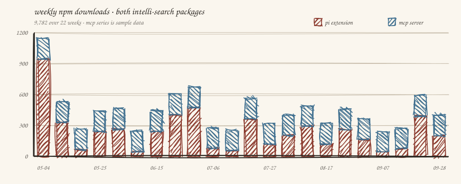

<!-- packages:mcp hidden
# mcp-intelli-search

[](https://www.npmjs.com/package/@curio-data/mcp-intelli-search)
[](https://nodejs.org/)
-->
<!-- packages:pi -->
# pi-intelli-search

[](https://www.npmjs.com/package/@curio-data/pi-intelli-search)
[](https://www.npmjs.com/package/@curio-data/pi-intelli-search)
[](https://github.com/earendil-works/pi)
<!-- /packages -->
[](./LICENSE)


Intelligent web research for coding agents: search, extract, collate, and cache grounded web context in one tool call. This repository provides two first-class packages from one research engine:

- `@curio-data/pi-intelli-search`: a [`Pi`](https://github.com/earendil-works/pi) extension that registers the four research tools natively, using `Pi` settings, authentication and the model registry.
- `@curio-data/mcp-intelli-search`: a standalone Model Context Protocol (MCP) server over standard input/output (stdio) for MCP-compatible hosts, including [_Claude Code_](https://code.claude.com/docs/en/mcp) and [_Codex_](https://developers.openai.com/codex/mcp).

Both packages run the same five-stage pipeline with the same cache format. [Install](#install) covers both the [`Pi` native extension](#pi-native-extension) and the [MCP server](#mcp-server), including direct MCP registration and host plugins.

The shared pipeline searches via a search-grounded model ([_Perplexity Sonar_](https://docs.perplexity.ai), the native default) and merges prose links with harvested citations before selecting pages. It fetches pages through a dual-fetch comparison ([_Defuddle_](https://github.com/kepano/defuddle) versus Markdown endpoint), then extracts query-relevant content per page with a dedicated large language model (LLM) guided by a _focused prompt_. Collation deduplicates findings, flags inconsistencies, and synthesises a concise summary. Everything is cached in `.search/` for offline reuse. Cache suggest surfaces related previous searches on each query.

## Two Packages, One Engine

Choose the installation route for the host:

| Route | Host | What to Install |
|---|---|---|
| Native `Pi` Extension | `Pi` | `@curio-data/pi-intelli-search` |
| Direct MCP Registration | Any MCP-compatible host | `@curio-data/mcp-intelli-search` |
| Host Plugin | Claude Code or Codex | Repository marketplace launching the pinned MCP package |

The install branches: [`Pi` Native Extension](#pi-native-extension) and [MCP Server](#mcp-server), with host instructions for [Claude Code](#claude-code), [Codex](#codex) and any [Generic MCP Host](#generic-mcp-host).

The native extension uses `Pi` settings and authentication. The MCP server requires explicit configuration, a per-folder workspace and an environment-supplied inference key; it does not read `Pi` settings or credentials. Its first registry publication is pending: use the [source-checkout launcher](#claude-code) until publication. The registry and plugin launchers below are post-publication routes.

## Contents

<!-- TOC:START -->

- [Two Packages, One Engine](#two-packages-one-engine)
- [Install](#install)
  - [`Pi` Native Extension](#pi-native-extension)
    - [Prerequisites](#prerequisites)
    - [Install the Extension](#install-the-extension)
    - [Verify Installation](#verify-installation)
    - [Customise (Optional)](#customise-optional)
  - [MCP Server](#mcp-server)
    - [Claude Code](#claude-code)
    - [Codex](#codex)
    - [Generic MCP Host](#generic-mcp-host)
- [Tools](#tools)
- [Quick Start](#quick-start)
  - [Quick Search](#quick-search)
  - [Deep Research](#deep-research)
  - [Targeted Research With Domain Guidance](#targeted-research-with-domain-guidance)
  - [Comparing Options](#comparing-options)
- [Launch Blog Post](#launch-blog-post)
- [What It Adds Over Other Extensions](#what-it-adds-over-other-extensions)
- [Configuration Recipes](#configuration-recipes)
  - [Recipe 1: Zero Configuration](#recipe-1-zero-configuration)
  - [Recipe 2: Web Search Tool + Nano](#recipe-2-web-search-tool--nano)
  - [Recipe 3: Sonar Pro Search](#recipe-3-sonar-pro-search)
  - [Recipe 4: Pin Eight Pages](#recipe-4-pin-eight-pages)
  - [Recipe 5: Economy Extract and Collate](#recipe-5-economy-extract-and-collate)
  - [Recipe 6: Stronger Collation](#recipe-6-stronger-collation)
  - [Recipe 7: Free-Tier Resilience](#recipe-7-free-tier-resilience)
  - [Recipe 8: Per-Project Override](#recipe-8-per-project-override)
- [Model Configuration](#model-configuration)
  - [Why OpenRouter for Sonar?](#why-openrouter-for-sonar)
  - [Source Harvesting from Citations](#source-harvesting-from-citations)
  - [OpenRouter Web Search Server Tool](#openrouter-web-search-server-tool)
    - [searchWebSearch Keys](#searchwebsearch-keys)
  - [Choosing an Alternative Search Configuration](#choosing-an-alternative-search-configuration)
  - [Swapping the Extract and Collate Model](#swapping-the-extract-and-collate-model)
  - [Model Selection Guidance](#model-selection-guidance)
  - [Required API Keys](#required-api-keys)
- [Pipeline](#pipeline)
- [Cost](#cost)
- [Settings](#settings)
  - [Settings Reference](#settings-reference)
  - [Automatic llms-full.txt Discovery](#automatic-llms-fulltxt-discovery)
- [MCP Server Reference](#mcp-server-reference)
  - [Requirements](#requirements)
  - [Verification](#verification)
  - [Serving the Protocol](#serving-the-protocol)
  - [Configuration](#configuration)
    - [Tuning](#tuning)
  - [Direct Engine Verification](#direct-engine-verification)
  - [Filesystem and Privacy Boundaries](#filesystem-and-privacy-boundaries)
  - [Timeouts and Troubleshooting](#timeouts-and-troubleshooting)
- [Cache Structure](#cache-structure)
- [Compatibility](#compatibility)
  - [`Pi` Extension Compatibility](#pi-extension-compatibility)
  - [MCP Server Compatibility](#mcp-server-compatibility)
- [Development](#development)
- [Documentation](#documentation)
- [Downloads](#downloads)
  - [`Pi` Extension Downloads](#pi-extension-downloads)
  - [MCP Server Downloads](#mcp-server-downloads)
- [Provenance](#provenance)
- [Sponsor](#sponsor)
- [License](#license)
- [Use of Large Language Models](#use-of-large-language-models)

<!-- TOC:END -->

<p align="center">
  
</p>

**Features:**

- 🔍 **Search:** a search-grounded model, [_Perplexity Sonar_](https://docs.perplexity.ai) via [_OpenRouter_](https://openrouter.ai) by default. One application programming interface (API) key, no $50 minimum. Any OpenRouter chat model works too via the [web search server tool](#openrouter-web-search-server-tool).
- 🔗 **Harvest:** every source the search model cited, not only the links it wrote into the answer. Machine-readable `url_citation` annotations are merged with text links before pages are selected.
- 🌐 **Fetch:** Dual-fetch each page (Hypertext Markup Language (HTML) → Defuddle versus Markdown endpoint), compare quality, pick the cleaner version.
- 📄 **Extract:** Per-page LLM extraction guided by a _focused prompt_. Compresses ≈50K to ≈3-5K chars of query-relevant content.
- 🔗 **Collate:** Cross-source deduplication, inconsistency detection, and synthesis into a focused ≈5K summary.
- 💾 **Cache:** Persistent `.search/` cache with automatic cache suggest. Related previous searches surfaced on each query.
- 🎯 **Configurable:** Select models independently for search, extract and collate. The native extension uses any model `Pi` supports; the MCP server uses explicitly selected OpenRouter models.
- 💰 **Cost:** see the [default research-run estimate](#cost).

<a id="use-with-other-hosts"></a>
## Install

Choose a package by host: the [`Pi` native extension](#pi-native-extension) for `Pi`, or the [MCP server](#mcp-server) for MCP-compatible hosts.

<!-- packages:pi -->
### `Pi` Native Extension

#### Prerequisites

You need at minimum an [OpenRouter](https://openrouter.ai) account: one key covers the default search model ([_Perplexity Sonar_](https://docs.perplexity.ai)) plus extraction and collation with the default models, and every [alternative search configuration](#choosing-an-alternative-search-configuration) uses the same account. For the extract and collate stages, any model or provider `Pi` supports can be used. See [Model Configuration](#model-configuration) for how to swap them.

1. **Sign In With Open Authorization (OAuth) (Recommended):** run `/login openrouter` in `Pi`. On `Pi` 0.82.0 and later this performs OpenRouter OAuth Proof Key for Code Exchange (PKCE) sign-in and stores a user-controlled key automatically. No manual key paste is required.
2. **Or add a key manually:** create one at [openrouter.ai/keys](https://openrouter.ai/keys), then edit `~/.pi/agent/auth.json`:

```json
{
  "openrouter": {
    "type": "api_key",
    "key": "sk-or-v1-..."
  }
}
```

#### Install the Extension

From `npm` (recommended):

```bash
pi install npm:@curio-data/pi-intelli-search
```

From _GitHub_:

```bash
pi install git:github.com/Curio-Data/pi-intelli-search
```

Local development:

```bash
pi install /path/to/pi-intelli-search
```

On first load, `Pi` will show `Added models:` followed by whatever was missing: on a fresh install that is `perplexity/sonar`, `perplexity/sonar-pro`, and `perplexity/sonar-pro-search`; an upgrade from an earlier version lists only the models you did not already have. If your OpenRouter key is missing, you will see a warning notification.

#### Verify Installation

Start `Pi` and type `/model`. You should see `perplexity/sonar`, `perplexity/sonar-pro`, and `perplexity/sonar-pro-search` in the model list. If they are missing after a manual edit, reopen `/model`: since `Pi` 0.82.0 the picker reloads `models.json` on open. Restart `Pi` only if they are still absent. Registration does not select a pipeline model; `searchModel` in settings does that.

#### Customise (Optional)

No configuration is needed to get started. The defaults use OpenRouter for all stages. If you want to change models, add a `pi-intelli-search` block to `~/.pi/agent/settings.json` or, for a trusted project, `<project>/.pi/settings.json`:

**Defaults (What You Get Without Any Config):**

No configuration is required. Explicit tuning values are preserved on upgrade, but explicitly selected models remain eligible for match-based migration when their provider and model match the upgrading version's historical default. Migration changes effective settings in memory, not the file (see `migrateDefaults()` in `src/settings.ts`). The table in [Settings Reference](#settings-reference) lists every accepted namespace key.

```jsonc
{
  "pi-intelli-search": {
    "searchModel": {
      "provider": "openrouter",
      "model": "perplexity/sonar"
    },
    "searchWebSearch": {
      "enabled": false,
      "engine": "auto",
      "maxResults": 8,
      "reasoning": "minimal"
    },
    "extractModel": {
      "provider": "openrouter",
      "model": "minimax/minimax-m3"
    },
    "collateModel": {
      "provider": "openrouter",
      "model": "minimax/minimax-m3"
    },

    "defaultUrls": 10,
    "maxUrls": 20,
    "cacheDir": ".search",
    "extractMaxChars": 150000,
    "extractionConcurrency": 4,
    "extractionMaxTokens": 3000,
    "collationMaxTokens": 4000,
    "fetchTimeoutMs": 20000,
    "fetchConcurrency": 4,
    "browserFingerprint": "chrome_145"
  }
}
```

**Customised Example (Different Provider, Tuned Pipeline):**

```jsonc
{
  "pi-intelli-search": {
    "searchModel": {
      "provider": "openrouter",
      "model": "perplexity/sonar"
    },
    "extractModel": {
      "provider": "openai",
      "model": "gpt-4o-mini"
    },
    "collateModel": {
      "provider": "openai",
      "model": "gpt-4o-mini"
    },

    "defaultUrls": 6,
    "maxUrls": 6,
    "cacheDir": ".my-research-cache",
    "extractMaxChars": 80000,
    "extractionMaxTokens": 8000,
    "collationMaxTokens": 16000,
    "fetchTimeoutMs": 30000,
    "fetchConcurrency": 2,
    "browserFingerprint": "chrome_145"
  }
}
```

See [Model Configuration](#model-configuration) for all options, [Configuration Recipes](#configuration-recipes) for complete copy-paste examples, and [Settings](#settings) for the full reference.
<!-- /packages -->

<!-- packages:mcp -->
### MCP Server

`@curio-data/mcp-intelli-search` serves the four research tools over stdio for MCP-compatible hosts. Choose direct registration or a host plugin from the [installation routes](#two-packages-one-engine).

The standalone server shares one engine with the native extension: the same five-stage pipeline, the same cache formats and the same local-only telemetry. It requires [Node.js](https://nodejs.org/) 22 or later, an explicitly selected JavaScript Object Notation (JSON) configuration file, an explicitly selected absolute workspace directory, and an OpenRouter key supplied through an environment variable. Inference is billed separately to that OpenRouter account; no `Pi` subscription or credential store is involved. The server reads no host credential stores, no `Pi` settings and no discovered project configuration. The complete configuration, security and troubleshooting reference is the [MCP Server Reference](#mcp-server-reference).

**Publication Status:** the standalone package's first registry publication is pending. Until it lands, the `npx` and plugin launchers below are unavailable; use the pre-publication source-checkout launcher under [Claude Code](#claude-code). This notice is removed at first publication.

<a id="route-b-claude-code-plugin"></a>
#### Claude Code

**Plugin (Post-Publication):**

[_Claude Code_](https://code.claude.com/docs/en/plugins) installs the plugin from this repository's marketplace; the launcher runs the pinned MCP package through `npx`:

```bash
claude plugin marketplace add Curio-Data/pi-intelli-search
claude plugin install intelli-search@curio-data-plugins
```

One-time setup: set your OpenRouter key in the plugin's required option, and write the plugin's `config.json`. Installing does not ask for the key; _Claude Code_ withholds the server until it is set. Set it in a session through `/plugin` → Installed → `intelli-search` → Configure, or from a shell with `claude plugin configure intelli-search@curio-data-plugins --values-stdin`. The key is kept in _Claude Code_'s credential store, not your shell profile. The plugin's `intelli-search` skill shows both steps in full after installation. The plugin places the research cache in the opened project's `.search/`. Verify with `claude mcp list`: `plugin:intelli-search:intelli_search` must show as connected. The first server start downloads the pinned package, so it needs network access and can take half a minute; later starts reuse the `npx` cache. Verified on Claude Code 2.1.289; the shell key route needs 2.1.285 or later. See the [compatibility matrix](docs/COMPATIBILITY.md).

**Direct Registration:**

Save the server's configuration (the `providers` and `models` example under [Generic MCP Host](#generic-mcp-host)) as `.intelli-search.json` in the target folder. Run registration from that folder. `local` is the default scope: private to the operator and active only in that folder. Add `--scope project` before `--` to write a shared `.mcp.json` into the folder; _Claude Code_ requires approval before connecting to project-scoped servers, and absolute paths in a shared file must be valid on each operator's machine.

**Post-Publication Launcher:**

```bash
claude mcp add intelli_search \
  -e "INTELLI_SEARCH_CONFIG=$PWD/.intelli-search.json" \
  -e "INTELLI_SEARCH_WORKSPACE=$PWD" \
  -- npx -y --package @curio-data/mcp-intelli-search \
  mcp-intelli-search
```

**Pre-Publication Source-Checkout Launcher:** run `npm run build:all` from this repository's root, then switch to the target folder and register the built server:

```bash
claude mcp add intelli_search \
  -e "INTELLI_SEARCH_CONFIG=$PWD/.intelli-search.json" \
  -e "INTELLI_SEARCH_WORKSPACE=$PWD" \
  -- node /absolute/path/to/pi-intelli-search/packages/mcp/dist/cli.js
```

Replace the checkout path with its actual absolute path. The configuration file can live at any readable absolute path, either per-folder or shared; replace the `INTELLI_SEARCH_CONFIG` value accordingly. Keep `INTELLI_SEARCH_WORKSPACE` per-folder so each folder has its own research cache. `OPENROUTER_API_KEY` must reach the server process environment, including when _Claude Code_ starts it.

Verify with `claude mcp list` from the target folder and confirm `intelli_search` is connected. Also run the chosen launcher with `--check-config` to validate configuration without credentials or inference; this does not test connectivity or model access. Both verification commands are shown in [Verification](#verification).

<a id="route-c-codex-plugin"></a>
#### Codex

**Plugin (Post-Publication):**

[_Codex_](https://developers.openai.com/codex/plugins) installs the same server from the same repository marketplace:

```bash
codex plugin marketplace add Curio-Data/pi-intelli-search
codex plugin add intelli-search --marketplace curio-data-plugins
```

Codex starts plugin servers with a filtered environment and no placeholder expansion, so export `OPENROUTER_API_KEY`, `INTELLI_SEARCH_CONFIG` and `INTELLI_SEARCH_WORKSPACE` before each `codex` launch; the plugin's `intelli-search` skill documents the fixed and per-project (`direnv`) patterns. Verified on Codex CLI 0.144.5; see the [compatibility matrix](docs/COMPATIBILITY.md).

<a id="route-a-direct-mcp-configuration"></a>
#### Generic MCP Host

This route covers any stdio host, including [_Open Code_](https://opencode.ai/docs/mcp-servers/). Adapt the registration JSON to the host's configuration format.

Any host that speaks MCP over stdio can register the server directly. The executable is `mcp-intelli-search`; after publication, an `npx` launch needs no separate install step (append `@<version>` to the package name to pin an exact release; the plugin routes pin for you):

```json
{
  "mcpServers": {
    "intelli_search": {
      "command": "npx",
      "args": [
        "-y",
        "--package",
        "@curio-data/mcp-intelli-search",
        "mcp-intelli-search"
      ],
      "env": {
        "INTELLI_SEARCH_CONFIG": "/absolute/config.json",
        "INTELLI_SEARCH_WORKSPACE": "/absolute/workspace"
      }
    }
  }
}
```

`OPENROUTER_API_KEY` must reach the server process environment (the server snapshots it at startup); use your host's secret mechanism or shell environment rather than committing it to a configuration file. A minimal explicit configuration selects OpenRouter for all three roles:

```json
{
  "providers": {
    "openrouter": {
      "apiKeyEnv": "OPENROUTER_API_KEY"
    }
  },
  "models": {
    "search": {
      "provider": "openrouter",
      "model": "perplexity/sonar"
    },
    "extract": {
      "provider": "openrouter",
      "model": "minimax/minimax-m3"
    },
    "collate": {
      "provider": "openrouter",
      "model": "minimax/minimax-m3"
    }
  }
}
```

These are explicit selections, not inherited defaults: the standalone package has no implicit provider or model choice. The research cache lands in `<workspace>/.search/`; the host reads cached pages with its own file-reading capability. Configuration and tuning details are canonical in [Configuration](#configuration).

Run the chosen launcher with `--check-config` to validate configuration and workspace without credentials or inference, then confirm the host connects and lists the four research tools. Configuration validation does not test connectivity or model access; use the [canonical verification commands](#verification).

On both plugin hosts the tools appear under host-qualified names (for example `mcp__intelli_search__intelli_research` on Codex). The installed `intelli-search` skill shows the exact names for its host. The native `Pi` extension and the MCP server are independent installations; enabling both in one agent gives duplicate tool sets, which is not a supported configuration.
<!-- /packages -->

## Tools

Both packages expose these four operations. The names below are native `Pi` tool names and MCP server tool names; MCP hosts add their own callable-name prefixes. Use the names exposed by the host.

| Tool               | Description                                                                                         |
| ------------------ | --------------------------------------------------------------------------------------------------- |
| `intelli_search`   | Search the web and return a concise answer with a source list (top `defaultUrls`).                   |
| `intelli_extract`  | Extract query-relevant content from a web page, preserving code and technical detail verbatim.      |
| `intelli_collate`  | Deduplicate and synthesise multiple extractions into a summary. Writes cache.                       |
| `intelli_research` | Search, fetch, extract, collate, cache. The primary research tool. One call.                        |

## Quick Start

### Quick Search

```text
intelli_search(query="TypeScript 5.8 release date")
```

### Deep Research

**Always provide a `focusPrompt`.** The extraction LLM works best with specific guidance.

```text
intelli_research(
  query="Svelte 5 runes tutorial examples",
  focusPrompt="Extract the core rune concepts ($state, $derived, $effect), their syntax, and how they replace the old reactive declarations. Include migration patterns from Svelte 4."
)
```

### Targeted Research With Domain Guidance

```text
intelli_research(
  query="Cloudflare Workers KV write timeout limits",
  focusPrompt="Extract KV write limits, timeout thresholds, storage limits, and any workarounds for bulk writes. Focus on hard numbers and error messages.",
  maxUrls=3,
  domains=["developers.cloudflare.com"]
)
```

`domains` guides source selection, it is not a security boundary: the query gains a `site:` expression, and with the web search tool enabled the same domains are also combined with `searchWebSearch.allowedDomains` and sent as an engine filter. The lists are combined, not intersected, and returned URLs are not checked against a local hostname allowlist before fetching. Engine support for allow and exclude lists differs (see [searchWebSearch Keys](#searchwebsearch-keys)).

### Comparing Options

```text
intelli_research(
  query="Tailwind CSS vs Vanilla Extract comparison 2026",
  focusPrompt="Extract pros/cons, bundle size benchmarks, DX tradeoffs, and migration costs. Note which claims come from official sources vs blog opinions."
)
```

<!-- packages:pi -->
## Launch Blog Post

<p align="center">
  <a href="https://blog.curiodata.pro/posts/22-pi-intelli-search/">
    
  </a>
</p>

Read the launch post, [_pi-intelli-search: LLM-Native Web Research for the Pi Coding Agent_](https://blog.curiodata.pro/posts/22-pi-intelli-search/), for the design story behind the pipeline: why per-page LLM extraction beats raw page dumps, how collation keeps the agent context clean, and the launch-era estimate of ≈$0.05 per session. The [Cost](#cost) section holds the current default estimate.

## What It Adds Over Other Extensions

<p align="center">
  
</p>

*The comparison illustration shows the default configuration and cost at its creation; search is configurable (see [Model Configuration](#model-configuration)).*

Four capabilities distinguish `intelli-search` within the seven-extension [May 2026 comparison](docs/COMPARISON.md#scope):

1. **Dual-fetch quality comparison.** Every page is fetched twice in parallel (Defuddle versus Markdown endpoint), scored, and the better version wins. Server-rendered Markdown is not guaranteed to be cleaner than HTML; the comparison catches this automatically.
2. **Per-page LLM extraction guided by `focusPrompt`.** Each page is compressed to ≈3-5K chars of query-relevant content before entering the agent's context. Extraction quality scales with the chosen model.
3. **LLM collation with deduplication.** A collation model synthesises across sources, flags conflicting claims, and preserves source attribution. The agent does not spend reasoning tokens on mechanical synthesis.
4. **Persistent cache with cache suggest.** Full pages and extractions are kept in `.search/` and indexed. An LLM judge surfaces related previous searches after each live query. Manually reusing a cached report can avoid a subsequent research call; cache suggest does not skip the current search.

The agent receives a concise ≈5K summary by default. The full page content stays in the cache, accessible via native `Pi` tools like `read` or `grep` for deeper inspection. Among the seven extensions in the May 2026 comparison, only `intelli-search` combines per-page extraction and a persistent structured cache.

For the detailed feature-by-feature comparison against six other `Pi` search extensions, see [docs/COMPARISON.md](docs/COMPARISON.md).


## Configuration Recipes

These recipes configure the native `Pi` extension. For MCP configuration, select models under `models` and tuning under `tuning` in the [standalone configuration file](#configuration); do not copy the native settings wrapper.

Each recipe is a complete `~/.pi/agent/settings.json`. Copy it whole, or lift the `pi-intelli-search` block into your existing file. Project-level overrides go in `<project>/.pi/settings.json` (applies only after `Pi` approves the project; the global file always applies).

Two loader rules to keep in mind:

- An object you set replaces its default wholesale. The `searchWebSearch` block and the model blocks have no per-key merge: set every key you care about.
- Nested `pi-intelli-search` keys always win over the deprecated flat `intelli*` keys.

| You want | Recipe |
|---|---|
| Works immediately, nothing to write | [Zero Configuration](#recipe-1-zero-configuration) |
| A chat model plus the web search server tool | [Web Search Tool + Nano](#recipe-2-web-search-tool--nano) |
| Sonar Pro Search via a model swap | [Sonar Pro Search](#recipe-3-sonar-pro-search) |
| The pre-0.13 page count | [Pin Eight Pages](#recipe-4-pin-eight-pages) |
| Cheaper extraction and collation | [Economy Extract and Collate](#recipe-5-economy-extract-and-collate) |
| Better final summaries | [Stronger Collation](#recipe-6-stronger-collation) |
| A free-tier or shared OpenRouter key | [Free-Tier Resilience](#recipe-7-free-tier-resilience) |
| A different search model for one repo only | [Per-Project Override](#recipe-8-per-project-override) |

Every recipe is exercised end-to-end in its own isolated environment by [`test/e2e/10_config_recipes.sh`](test/e2e/10_config_recipes.sh); recipes 2 and 3 by `08_websearch_tool.sh` and `09_sonar_pro_search.sh`.

### Recipe 1: Zero Configuration

Write nothing. You get Sonar search with citation harvesting, MiniMax M3 extraction and collation, 10 pages per session, and the `.search/` cache. Every other recipe below changes exactly one concern from this baseline.

### Recipe 2: Web Search Tool + Nano

Any OpenRouter chat model gains live search through the `openrouter:web_search` server tool, so nothing depends on a search-native model family. The September 2026 probe estimate for this pairing is ≈$0.008 per search, not a lowest-cost ranking. The `reasoning: "minimal"` pin matters: GPT-5 family models burn their completion budget on reasoning when left unconstrained.

```jsonc
{
  "pi-intelli-search": {
    "searchModel": {
      "provider": "openrouter",
      "model": "openai/gpt-5-nano"
    },
    "searchWebSearch": {
      "enabled": true,
      "engine": "exa",
      "maxResults": 8,
      "reasoning": "minimal"
    },
    "extractModel": {
      "provider": "openrouter",
      "model": "minimax/minimax-m3"
    },
    "collateModel": {
      "provider": "openrouter",
      "model": "minimax/minimax-m3"
    }
  }
}
```

### Recipe 3: Sonar Pro Search

Agentic multi-step search on the Perplexity stack, reached through a settings-only model swap. The recorded estimate is ≈$0.05 per search ($18 per 1,000 requests plus tokens); it is not a comparative quality measurement. `searchWebSearch` is disabled explicitly so this recipe stays correct even if you previously enabled the tool.

```jsonc
{
  "pi-intelli-search": {
    "searchModel": {
      "provider": "openrouter",
      "model": "perplexity/sonar-pro-search"
    },
    "searchWebSearch": {
      "enabled": false
    },
    "extractModel": {
      "provider": "openrouter",
      "model": "minimax/minimax-m3"
    },
    "collateModel": {
      "provider": "openrouter",
      "model": "minimax/minimax-m3"
    }
  }
}
```

### Recipe 4: Pin Eight Pages

v0.13.0 raised `defaultUrls` to 10 and `maxUrls` to 20 because citation harvesting fills the URL list. To retain the earlier page-count settings, pin both values. This recipe previously recorded ≈$0.004 per extracted page without specifying an input/output budget. That unscoped figure is historical, not the default M3 estimate in [Cost](#cost).

```jsonc
{
  "pi-intelli-search": {
    "defaultUrls": 8,
    "maxUrls": 16
  }
}
```

### Recipe 5: Economy Extract and Collate

Extraction and collation run 10+1 times per session, so token rates dominate cost. Swap both stages to a cheaper OpenRouter model; search is untouched. Any model `Pi` supports works for these stages.

```jsonc
{
  "pi-intelli-search": {
    "extractModel": {
      "provider": "openrouter",
      "model": "google/gemini-3.7-flash"
    },
    "collateModel": {
      "provider": "openrouter",
      "model": "google/gemini-3.7-flash"
    }
  }
}
```

Convert `extractMaxChars` to an estimated input-token budget (150K chars is ≈37K tokens), then add prompt tokens and reserve `extractionMaxTokens` for output. Lower the character limit if that total exceeds the model's token window.

### Recipe 6: Stronger Collation

Keep extraction cheap and spend on the final synthesis, where cross-source reasoning and contradiction-flagging live. Only `collateModel` changes.

```jsonc
{
  "pi-intelli-search": {
    "collateModel": {
      "provider": "openrouter",
      "model": "openai/gpt-5-mini"
    }
  }
}
```

### Recipe 7: Free-Tier Resilience

Free-tier OpenRouter keys share a ≈0.33 requests/second bucket. The extract stage fires up to 4 concurrent calls, which trips it. Space the calls, lengthen the retries, and shrink the page count.

```jsonc
{
  "pi-intelli-search": {
    "defaultUrls": 5,
    "minRequestIntervalMs": 3000,
    "extractionConcurrency": 2,
    "llmRetryAttempts": 4,
    "llmTimeoutMs": 120000
  }
}
```

Choose pacing, concurrency and retry settings from observed account and provider rate limits, whether the key is paid, free-tier or shared. Leave the throttle off when the account handles the default fan-out without rate-limit failures.

### Recipe 8: Per-Project Override

A trusted project can override individual keys for one repository only. Put the override in `<project>/.pi/settings.json`; everything not listed keeps its global value.

```jsonc
{
  "pi-intelli-search": {
    "searchModel": {
      "provider": "openrouter",
      "model": "perplexity/sonar-pro-search"
    },
    "cacheDir": ".search-client-x"
  }
}
```

Use this to give a client project a dedicated cache directory and a stronger search model while every other project stays on the global defaults.

## Model Configuration

Both packages select models independently for search, extract and collate. The configuration below is for the native `Pi` extension; the MCP server requires explicit OpenRouter selections for all three roles in its [configuration file](#configuration), with no implicit model defaults.

Native defaults are chosen for cost-efficiency, but **any model `Pi` can access works**. This includes built-in providers, [OpenRouter](https://openrouter.ai) models, or models from other extensions.

| Stage   | Default                       | Config key              |
| ------- | ----------------------------- | ----------------------- |
| Search  | `openrouter/perplexity/sonar` | `searchModel`           |
| Extract | `openrouter/minimax/minimax-m3` | `extractModel`      |
| Collate | `openrouter/minimax/minimax-m3` | `collateModel`      |

### Why OpenRouter for Sonar?

[_Perplexity Sonar_](https://docs.perplexity.ai) is an excellent search-grounded model, but it is not in `Pi`'s built-in model list. Rather than requiring a separate Perplexity API account (which requires a **$50 minimum credit top-up**), the extension routes _Sonar_ through [OpenRouter](https://openrouter.ai). _OpenRouter_ is a unified pay-as-you-go API with a lower minimum spend. One API key gives you _Sonar_ alongside thousands of other models. On first load, the extension patches `~/.pi/agent/models.json` to add _Sonar_ under the `openrouter` provider so `Pi` can discover it. This approach has several benefits:

- **Avoids the Perplexity API $50 minimum.** Routing through `OpenRouter` consolidates spend on a single account already used across the open-source coding-agent ecosystem, including `Pi`. No separate _Perplexity_ subscription is required.
- **One account, many models.** The same OpenRouter key covers _Sonar_ and any other models you might want for extract or collate.
- **Is non-destructive.** The patch merges new models by ID. It never replaces existing OpenRouter models.
- **Is idempotent.** It is safe across extension reloads and updates.

The same single-key argument covers the alternative search configurations: the [web search server tool](#openrouter-web-search-server-tool) and [`perplexity/sonar-pro-search`](#choosing-an-alternative-search-configuration) both route through the same OpenRouter account.

### Source Harvesting from Citations

Search-grounded models return machine-readable `url_citation` annotations naming the sources they consulted, a larger set than the links they write into the prose (probe: 20 annotations against 3 prose links from _Sonar_). `Pi`'s chat-completions adapter reassembles only text, thinking, and tool-call blocks, so those annotations never reach extension code on their own. The pipeline reads a tee of the raw response body, parses the citations out, and merges them with the text-scraped links before pages are selected for fetching.

This runs on every search call regardless of model, needs no configuration, and never blocks or fails the pipeline. Text links come first; annotation-only links follow; exact URL duplicates are removed. `intelli_research` applies its URL limit after merging, so not every discovered source is fetched. Harvesting is best-effort: a model that emits no annotations, or annotations the parser does not recognise, leaves the text-link path intact. `intelli_search` caps its rendered source list at `defaultUrls` (top 10 by default). The count is recorded in `meta.json` as `stages.search.annotationsHarvested`.

### OpenRouter Web Search Server Tool

The search stage normally relies on a search-native model (default: _Sonar_). The `searchWebSearch` setting decouples it: [OpenRouter](https://openrouter.ai)'s `openrouter:web_search` server tool gives the configured chat model access to live web search, so the pipeline is not tied to any search-native model family. The tool is beta upstream; the model decides whether and how many times to search, and search charges depend on the engine, the number of server-side searches, and token usage. `maxResults` limits results per search and `maxUrls` limits pages fetched; neither caps total search spend.

**`searchWebSearch` requires `searchModel.provider` to be `openrouter`.** The tool id is OpenRouter-specific; on any other provider the setting is ignored without warning.

A probe-validated pairing (2026-09): `openai/gpt-5-nano` with engine `exa` and `reasoning: "minimal"`, at ≈$0.008 per search with 5-17 cited sources:

```jsonc
{
  "pi-intelli-search": {
    "searchModel": {
      "provider": "openrouter",
      "model": "openai/gpt-5-nano"
    },
    "searchWebSearch": {
      "enabled": true,
      "engine": "exa",
      "maxResults": 8,
      "reasoning": "minimal"
    }
  }
}
```

#### searchWebSearch Keys

A supplied object replaces the entire default object; there is no per-key merge. A trusted project's object also replaces the global one. Omitting `reasoning` gives `low`, not `minimal`; omitting `maxResults` sends no result-count override and OpenRouter applies its own default (5).

| Key | Values | Notes |
|---|---|---|
| `enabled` | `true`, `false` | Off by default. Requires `searchModel.provider` to be `openrouter`. |
| `engine` | `auto`, `native`, `exa`, `parallel`, `perplexity`, `firecrawl` | `auto` (and unrecognised values) are omitted from the payload, leaving OpenRouter's default. |
| `maxResults` | 1-25 (1-20 on `perplexity`) | Rounded and clamped by the extension. Per engine search, not per session. |
| `searchContextSize` | `low` (≈5K chars), `medium` (≈15K), `high` (≈30K) | Engine-specific budgets; some engines ignore it. |
| `allowedDomains` | array of domains | Combined (not intersected) with the per-call `domains` tool parameter. Cannot be combined with `excludedDomains` except on `exa`. |
| `excludedDomains` | array of domains | As above. |
| `reasoning` | `minimal`, `low`, `medium`, `high` | Falls back to `low` when omitted. Use `minimal` explicitly with GPT-5 family models, which otherwise burn reasoning budget when paired with the tool. |

The extension exposes a subset of the server tool's parameters. Upstream `mode`, `max_uses`, `max_total_results`, `max_characters`, and `user_location` are not settable through this block. The `firecrawl` engine additionally requires your own Firecrawl account configured with OpenRouter (BYOK); the other engines bill through OpenRouter credits.

### Choosing an Alternative Search Configuration

The default search model is `perplexity/sonar` (≈$0.007 per search). Two configurable alternatives use the same OpenRouter account:

| Option | Model | Setting | Cost per search |
|---|---|---|---|
| Server tool | `openai/gpt-5-nano` + `engine: "exa"` | `searchWebSearch.enabled: true` | ≈$0.008 |
| Model swap | `perplexity/sonar-pro-search` | `searchModel` only | ≈$0.05 |
| Current default | `perplexity/sonar` | none | ≈$0.007 |

The model swap is settings-only:

```jsonc
{
  "pi-intelli-search": {
    "searchModel": {
      "provider": "openrouter",
      "model": "perplexity/sonar-pro-search"
    },
    "searchWebSearch": {
      "enabled": false
    }
  }
}
```

`perplexity/sonar-pro-search` bills $18 per 1,000 requests on top of $3/$15 per 1M tokens ([model card](https://openrouter.ai/perplexity/sonar-pro-search)). It buys agentic multi-step search; it is not the cheap option. Explicitly disabling `searchWebSearch` in the example makes it safe to apply after previously enabling the server tool: changing `searchModel` alone does not clear that separate setting.

### Swapping the Extract and Collate Model

[_MiniMax_](https://minimax.io) M3 (via OpenRouter) is the native default. In [baseline runs 1A, 2A, 1B, 2B and 3C](docs/BENCHMARKS.md#baseline-findings), its collations stated their ranking methodology, caveated low-evidence claims and flagged compatibility warnings. M3's recorded ≈1M-token window provides input headroom at the default character limit. M3 and M2.7 had equal per-token pricing in that benchmark, while M3 wrote ≈2× the extraction output. The recorded default-switch estimate therefore doubled extract-stage output-token cost, not whole-session cost (see [Decision Recorded](docs/BENCHMARKS.md#decision-recorded)). Selecting `minimax/minimax-m2.7` requests leaner extractions, but values matching an upgrading version's historical default remain eligible for model migration. You can also use any model `Pi` supports. Override in `~/.pi/agent/settings.json` or `.pi/settings.json`:

**Option A: Use a `Pi` Built-In Provider** (auth via `/login`):

```jsonc
{
  "pi-intelli-search": {
    "extractModel": {
      "provider": "openai",
      "model": "gpt-4o-mini"
    },
    "collateModel": {
      "provider": "openai",
      "model": "gpt-4o-mini"
    }
  }
}
```

**Option B: Use Another OpenRouter Model** (same key, no extra setup):

```jsonc
{
  "pi-intelli-search": {
    "extractModel": {
      "provider": "openrouter",
      "model": "google/gemini-2.0-flash-001"
    },
    "collateModel": {
      "provider": "openrouter",
      "model": "google/gemini-2.0-flash-001"
    }
  }
}
```

**Option C: Use a Model Provided by Another Extension** (for example, Z.Ai or local models):

```jsonc
{
  "pi-intelli-search": {
    "extractModel": {
      "provider": "zai",
      "model": "glm-5.1"
    },
    "collateModel": {
      "provider": "zai",
      "model": "glm-5.1"
    }
  }
}
```

The only requirement is that the model is registered in `Pi`'s model registry and has auth configured. Run `/login` to set up built-in providers, or follow the extension's own setup for extension-provided models.

### Model Selection Guidance

For extraction and collation, the ideal model has:

- **Low cost per token:** 10 extractions, 1 collation, and 1 cache suggest per default session.
- **Good instruction following:** Must adhere to extraction prompts precisely.
- **Sufficient context:** Cleaned pages can be ≈50K chars (truncated to `extractMaxChars`).

Models known to work well for extraction and collation: _MiniMax_ M3 (default, ≈1M context, via OpenRouter), _MiniMax_ M2.7 (leaner extractions, half the output tokens, via OpenRouter), _Qwen_ 3.5-Flash (≈1M context, ≈$0.26/M output), _DeepSeek_ V4 Flash (≈1M context, ≈$0.28/M output), _Gemini_ 2.0 Flash Lite (≈1M context, ≈$0.30/M output), _GPT-4.1_ Nano (≈1M context, ≈$0.40/M output).

### Required API Keys

With default settings, you need one key in `~/.pi/agent/auth.json`:

```json
{
  "openrouter": {
    "type": "api_key",
    "key": "sk-or-v1-..."
  }
}
```

A single [OpenRouter](https://openrouter.ai) key is the minimum required. It covers the default search model (Sonar) plus MiniMax M3 for extraction and collation with the default models. The extract and collate stages can use any model `Pi` supports. Override `extractModel` or `collateModel` in settings to switch providers.

Run `/login openrouter` in `Pi` to authorise via OAuth (`Pi` 0.82.0 and later), or edit the file directly with a key from [openrouter.ai/keys](https://openrouter.ai/keys).
<!-- /packages -->

## Pipeline

<p align="center">
  
</p>

The illustration shows the native pipeline with the model configuration at its creation, including MiniMax M2.7 and `Pi` authentication; it does not show the current defaults or standalone authentication. All model assignments are configurable (see [Model Configuration](#model-configuration)); alternative search configurations use the same five-stage pipeline.

The search stage merges text links with harvested citation annotations before selecting pages (see [Source Harvesting from Citations](#source-harvesting-from-citations)). Each page is dual-fetched (HTML via Defuddle versus Markdown endpoint) and scored for quality. Per-page extraction (guided by `focusPrompt`) compresses ≈50K chars to ≈3-5K of query-relevant content before collation, keeping the total context manageable (≈30-50K for 10 pages).

At the end of each run the pipeline writes a local-only `meta.json` telemetry sidecar into the cache directory (see [Cache Structure](#cache-structure)). Set `disableTelemetry: true` to suppress it.

See [docs/ARCHITECTURE.md](docs/ARCHITECTURE.md) for detailed design decisions.

## Cost

The estimate below uses the native default models and tuning, also selected in the minimal MCP configuration example. It is a planning estimate based on the recorded September 2026 price basis, not a live tariff check. Both packages incur inference charges on the configured provider account; MCP does not use host subscriptions or credentials.

Per research session with the default 10 pages: **≈$0.09**

| Step                           | Calls            | Cost     |
| ------------------------------ | ---------------- | -------- |
| Search (_Sonar_)               | 1                | ≈$0.007  |
| Fetch (Defuddle + Markdown)    | 10 (≤4 concurrent) pairs | $0.00    |
| Extract (M3 via OpenRouter)         | 10 (≤4 concurrent) | ≈$0.07   |
| Collate (M3 via OpenRouter)         | 1                | ≈$0.01   |
| Cache suggest (M3 via OpenRouter)   | 1                | ≈$0.0002 |

Since v0.13.0 the search stage contributes every source the model cited, not only the ones it wrote into the prose, so sessions reach the `defaultUrls` page count more often than before. The ≈$0.09 figure is the planning estimate for a full 10-page research run with the v0.14.0 default models (M3 extracts cost the same per token as M2.7 but write ≈2× the output tokens); lower `defaultUrls` to hold earlier spend. Changing the search model or engine also changes the search step's cost (see [Choosing an Alternative Search Configuration](#choosing-an-alternative-search-configuration)); the extract and collate rows scale with your chosen models.

<!-- packages:pi -->
## Settings

This section describes native `Pi` settings. The MCP server reads only its explicitly selected file; its accepted keys, ranges and policy differences are documented in [Configuration](#configuration) and [Tuning](#tuning).

Override defaults in `~/.pi/agent/settings.json` or, for a trusted project, `<project>/.pi/settings.json` under the `pi-intelli-search` namespace. `Pi` ignores project-local settings until you approve the project; the global file always applies:

```jsonc
{
  "pi-intelli-search": {
    // Model assignments (see Model Configuration above)
    "searchModel": {
      "provider": "openrouter",
      "model": "perplexity/sonar"
    },
    "extractModel": {
      "provider": "openrouter",
      "model": "minimax/minimax-m3"
    },
    "collateModel": {
      "provider": "openrouter",
      "model": "minimax/minimax-m3"
    },

    // Pipeline tuning
    "defaultUrls": 10,
    "maxUrls": 20,
    "cacheDir": ".search",
    "extractMaxChars": 150000,
    "extractionMaxTokens": 3000,
    "collationMaxTokens": 4000,

    // Fetch behaviour
    "fetchTimeoutMs": 20000,
    "fetchConcurrency": 4,
    "browserFingerprint": "chrome_145"
  }
}
```

### Settings Reference

| Setting | Stage | Default | What It Does |
|---|---|---|---|
| `searchModel` | 1. Search | `openrouter/perplexity/sonar` | Model for the initial web search. Swap to a stronger model for deeper search results, or to a cheaper one to reduce the ≈$0.007 search cost. See [Model Configuration](#model-configuration). |
| `searchWebSearch` | 1. Search | see [reference](#openrouter-web-search-server-tool) | Attach OpenRouter's `openrouter:web_search` server tool to the search-stage call so a plain OpenRouter chat model gains access to live search. Off by default; requires `searchModel.provider` to be `openrouter`. Full key reference in [OpenRouter Web Search Server Tool](#openrouter-web-search-server-tool). |
| `extractModel` | 3. Extract | `openrouter/minimax/minimax-m3` | Model for per-page content extraction. Runs 10 times per session so low cost per token matters. Estimate tokens from `extractMaxChars`, add system and user prompt tokens, and reserve `extractionMaxTokens` for output. Compare that total with the model's token window and lower the character limit if needed. See [Model Configuration](#model-configuration). |
| `collateModel` | 4. Collate | `openrouter/minimax/minimax-m3` | Model for cross-source synthesis and deduplication. Sees all extractions at once so it needs enough context and instruction-following to flag contradictions. A model with ≥128K context handles 8 full extractions comfortably. See [Model Configuration](#model-configuration). |
| `defaultUrls` | 1 → 2 | `10` | Fallback when the agent does not pass `maxUrls` per call; also caps `intelli_search`'s rendered source list. Lower values reduce cost and latency but give less thorough results. The agent's [skill guide](skills/intelli-search/SKILL.md) recommends 3 (targeted), 10 (broad), or 16 (exhaustive). Raised from 8 in v0.13.0: citation harvesting fills the URL list, so the pipeline can use more sources than prose links alone provided. |
| `maxUrls` | 1 → 2 | `20` | Hard cap on URLs fetched. Lower caps mean faster responses and lower cost; higher caps allow more thorough research. Each extra successfully extracted page adds ≈$0.007 under the M3 output-volume estimate in [Cost](#cost). Requests above the cap are silently clamped. Raised from 16 in v0.13.0. |
| `cacheDir` | 4, 5 | `.search` | Directory where research sessions are cached. Change this to keep project-specific research separate. Example: `".my-research-cache"`. |
| `extractMaxChars` | 3. Extract | `150000` | Maximum characters of page content fed to the extract LLM per page. Each 50K chars consumes ≈12K input tokens as a planning approximation; the model's tokenizer determines the actual count. Add prompt tokens and reserved output (`extractionMaxTokens`) before comparing with the token window. Lower this limit if that budget does not fit; raise it only with sufficient headroom. |
| `extractionConcurrency` | 3. Extract | `4` | Number of per-page extractions sent to the extract model simultaneously. Bounded so a wide result set does not fire many concurrent LLM calls and trigger rate limiting. Raise it (6-8) on generous rate limits for faster extraction; lower it (1-2) on tight limits. |
| `extractionMaxTokens` | 3. Extract | `3000` | Maximum output tokens for each per-page extraction. Higher values preserve more detail at higher cost. **Lower this when using a model with a small context window** so the output does not crowd out the input. The extract prompt targets 3,000-5,000 characters; 3,000 tokens covers this comfortably. |
| `collationMaxTokens` | 4. Collate | `4000` | Maximum output tokens for the final synthesis. Lower values force tighter deduplication. **Lower this when using a collation model with a small context window** (the output must fit alongside all extraction inputs). The summary you see in the agent context is bounded by this setting. |
| `fetchTimeoutMs` | 2. Fetch | `20000` | Per-page fetch timeout in milliseconds. Increase if you research sites known to be slow. Fetches run in parallel so this does not multiply by page count. |
| `fetchConcurrency` | 2. Fetch | `4` | Number of pages fetched simultaneously. Higher values (6-8) complete the fetch stage faster but may trigger rate limiting. Lower values (2) are gentler on target servers. |
| `browserFingerprint` | 2. Fetch | `chrome_145` | Transport Layer Security (TLS) fingerprint used by [_wreq-js_](https://github.com/sqdshguy/wreq-js) to impersonate a browser. Determines which Hypertext Transfer Protocol (HTTP) client signature the site sees. Available profiles include `chrome_*`, `firefox_*`, `safari_*`, `edge_*`, and `opera_*` across many versions. Change this if a site blocks the default fingerprint. |
| `llmTimeoutMs` | Research LLM | `90000` | Hard per-call timeout in milliseconds for each model request inside `intelli_research`. Bounds a stalled provider connection (common under rate limiting) so it becomes a retryable timeout instead of hanging on the SDK's long default. Raise it for slow reasoning models on large inputs; lower it to fail faster. |
| `llmRetryAttempts` | Research LLM | `3` | Total attempts per LLM call including the first. Transient failures (HTTP 429, 5xx, timeouts) are retried with full-jitter exponential backoff that honours any Retry-After hint. Set to `1` to disable retry. |
| `retryBaseDelayMs` | Research LLM | `1500` | Base delay for retry backoff. Attempt N waits a random duration up to `min(retryMaxDelayMs, retryBaseDelayMs * 2^(N-1))`. |
| `retryMaxDelayMs` | Research LLM | `20000` | Upper bound on any single retry backoff, and the clamp applied to a Retry-After hint so a large hint cannot stall the pipeline. |
| `searchRetryAttempts` | 1. Search | `2` | Total attempts for the search stage when it returns a valid response with zero usable links (a degraded result), including the first. Independent of `llmRetryAttempts`, which covers transport errors. |
| `minRequestIntervalMs` | 3. Extract | `0` | Minimum gap in milliseconds between concurrent extract LLM calls. `0` disables the throttle. For an observed account limit of approximately 0.33 requests per second, use approximately `3000`. Adjust to observed limits rather than payment status. |
| `disableLlmsFullDiscovery` | Supplementary Fetch | `false` | Set `true` to skip automatic `llms-full.txt` probes and downloads. This does not disable page fetching or extraction. See [Automatic llms-full.txt Discovery](#automatic-llms-fulltxt-discovery). |
| `disableTelemetry` | All | `false` | When `false`, each `intelli_research` run writes a local-only `meta.json` sidecar into its `.search/<slug>/` cache directory recording per-stage outcomes (pages fetched/failed, fetch-variant winners, links and harvested annotations, search-retry, cache-suggest hits, latency). Strictly local: no network call, no data leaves the host. Set `true` to suppress the sidecar. |

`httpProxy` is a separate top-level `Pi` setting, not a `pi-intelli-search` namespace key; page fetching honours it too. Its default is unset.

The model retry and timeout settings apply inside `intelli_research`. The native standalone `intelli_search`, `intelli_extract` and `intelli_collate` tools retain one model attempt and no application-level timeout; they still accept cancellation. Provider connection limits are separate from the research pipeline's streaming-body timeout.

### Automatic llms-full.txt Discovery

Sites that follow the [`llms-full.txt` convention](https://llmstxt.org) publish a single Markdown file containing their complete documentation. During the fetch stage, every domain in the search results is probed at `https://domain/llms-full.txt`. If the file exists (HTTP 200), it is downloaded raw to `sources/llms-full-*.md` for offline search with `grep` or `read`.

These probes are supplementary and never gate the research result. Each runs under a tight timeout and honours cancellation, so a slow or unresponsive documentation host cannot stall the summary, and pressing Esc cancels them along with the rest of the pipeline. Set `disableLlmsFullDiscovery: true` to skip the probes entirely.

A small built-in list handles sites with non-standard paths:

| Site | Path Pattern |
|------|-------------|
| Cloudflare Docs | `/product/llms-full.txt` |
| Next.js | `/docs/llms-full.txt` |
| Vite | `/llms-full.txt` (root) |

No configuration is needed. The probe and download are automatic.
<!-- /packages -->

<!-- packages:mcp -->
## MCP Server Reference

This reference applies to `@curio-data/mcp-intelli-search` only. Installation routes are under [MCP Server](#mcp-server).

### Requirements

- [_Node.js_](https://nodejs.org/) satisfying the `engines` range in the [standalone manifest](packages/mcp/package.json).
- An existing, explicitly selected absolute workspace directory.
- An explicitly selected JSON configuration file.
- A separately billed OpenRouter API key supplied through a named environment variable before constructing the runtime. Restart the runtime after changing credentials; it snapshots the environment.
- A platform supported by [_wreq-js_](https://github.com/sqdshguy/wreq-js), the browser-fingerprint fetch dependency. The installation gate exercises its native assets on the running platform; it does not establish support for other platforms.

The package neither reads host credential stores nor loads project configuration automatically. Native `Pi` settings, authentication, providers and defaults remain independent.

### Verification

From the target folder, check the registered server:

```bash
claude mcp list
```

Confirm `intelli_search` shows as connected. If a project-scoped server shows pending approval, open _Claude Code_ in that folder and approve it before checking again.

Validate the configuration separately without credentials or inference. After publication, use:

```bash
INTELLI_SEARCH_CONFIG="$PWD/.intelli-search.json" \
INTELLI_SEARCH_WORKSPACE="$PWD" \
npx -y --package @curio-data/mcp-intelli-search \
  mcp-intelli-search --check-config
```

For the source-checkout launcher, use:

```bash
node /absolute/path/to/pi-intelli-search/packages/mcp/dist/cli.js \
  --config "$PWD/.intelli-search.json" \
  --workspace "$PWD" \
  --check-config
```

Use the same configuration path as the registered server if it is shared or stored elsewhere. A successful check prints `Configuration is valid.` and exits with status `0`. It validates configuration and workspace, not host connectivity, credentials or model access. `claude mcp list` checks the host connection; successful inference requires the separate provider key.

### Serving the Protocol

An invocation without `--check-config` validates the explicit configuration and workspace, then serves the four canonical tools (`intelli_search`, `intelli_extract`, `intelli_collate`, `intelli_research`) over stdio until the input stream closes. Serving performs no inference at startup; credentials are only required when an operation runs.

- **Registration and Schemas.** Tool names and JSON input schemas mirror the native `Pi` tools verbatim; descriptions adapt the native guidance for protocol clients (host-neutral cache wording, embedded `focusPrompt` and breadth guidance), because the protocol offers no separate guidance channel. Invalid tool arguments are reported as tool errors (`isError` results), matching the SDK (software development kit) distinction between malformed protocol requests and invalid arguments.
- **Results.** Successful calls return the concise summary as text content plus structured content with `outcome` and `details`. Degraded research (`no-links`, `fetch-failed`, `extraction-failed`) remains a normal result. Execution failures return `isError` results tagged with the safe `StandaloneError` category rather than raw provider causes.
- **Queueing.** One operation runs at a time and up to eight further requests queue; requests beyond the bound settle immediately with a busy tool error. A queued request whose client cancels settles without starting its operation.
- **Progress and Cancellation.** When the client supplies a progress token, stage progress is forwarded as `notifications/progress` (percentage of one hundred). Client cancellation aborts the running operation through the shared model policy and stage boundaries.
- **Shutdown.** Closing standard input aborts in-flight and queued work, closes the transport and exits. `SIGINT` and `SIGTERM` trigger the same drain with a bounded hard-exit backstop. No unanswered request or runaway child work remains.
- **Framing.** Standard output carries protocol messages only. Before the server module loads, a guard diverts `process.stdout.write` (including console output, import-time writes and direct dependency writes) to standard error; the transport writes frames through the original stream, so the SDK's own output is never corrupted. Adapter diagnostics use standard error.
- **Annotations.** `intelli_search` and `intelli_extract` are marked read-only; `intelli_collate` and `intelli_research` write cache files and are not read-only. No tool claims idempotence. Operations use external services; inference and search charges apply to the configured provider account. Invalid calls and startup validation do not perform inference.

Startup diagnostics go to standard error. The SDK version range is declared in `package.json` (the lockfile pins the verified release); the protocol implementation is the official split server package verified in the repository handoff.

### Configuration

Select the configuration with `--config FILE` or `INTELLI_SEARCH_CONFIG`. Select the workspace with `--workspace ABSOLUTE_DIRECTORY` or `INTELLI_SEARCH_WORKSPACE`. Command-line values take precedence. Relative workspace paths are rejected; existing workspace symlinks are canonicalised.

The minimal example under [Generic MCP Host](#generic-mcp-host) explicitly selects OpenRouter for every role; add an optional `tuning` object (for example `"cacheDir": ".search"`) beside `providers` and `models`. These are example selections, not standalone defaults.

Only `providers`, `models` and optional `tuning` are accepted at the top level. All three model roles are required. The provider object accepts only `apiKeyEnv`, an environment-variable name rather than a key value. The initial provider scope is OpenRouter at its fixed `https://openrouter.ai/api/v1` endpoint; custom endpoints, proxy settings, provider fallback and dynamic router model identifiers are not accepted.

Configuration loading does not require working credentials. Each operation validates its required model roles against OpenRouter's model catalogue before inference. Full research validates all three roles first. Validation checks exact identifiers, text input/output, advertised reasoning efforts when supplied, and tool support for an enabled search tool. Catalogue lookup is bounded and cancellable. It establishes advertised capabilities, not account credit, per-key model access or future provider availability; inference errors remain possible.

Search requires either `perplexity/sonar`, `perplexity/sonar-pro`, `perplexity/sonar-pro-search`, or an explicitly enabled `searchWebSearch` block with a chat model. Enabling `searchWebSearch` also requires the selected model to advertise `tools` support. Combining that block with a Sonar model that does not advertise tool support fails preflight; the adapter does not silently drop the configured tool. Search tools are model-decided; a valid response can still contain no usable links.

#### Tuning

Unspecified tuning comes from the canonical [shared defaults](src/core/defaults.ts), also used by the native adapter. The table gives each default and its effect alongside standalone validation ranges. No provider or model selection is inherited from that module. Unknown keys, invalid types and out-of-range values are rejected rather than silently clamped.

| Setting | Default and Effect | Accepted Values |
|---|---|---|
| `defaultUrls` | `10`: fallback page budget and one-shot search source-list cap | Integer from 1 to 100; must not exceed `maxUrls` |
| `maxUrls` | `20`: hard cap on research pages | Integer from 1 to 100 |
| `extractMaxChars` | `150000`: per-page extraction input character limit | Integer from 1 to 2,000,000 |
| `fetchTimeoutMs` | `20000`: page-fetch timeout in milliseconds | Integer from 1 to 600,000 |
| `llmTimeoutMs` | `90000`: application timeout per model call in milliseconds | Integer from 1 to 600,000 |
| `fetchConcurrency` | `4`: simultaneous page fetches | Integer from 1 to 32 |
| `extractionConcurrency` | `4`: simultaneous per-page extractions | Integer from 1 to 32 |
| `extractionMaxTokens` | `3000`: per-page output-token limit | Integer from 16 to 128,000 |
| `collationMaxTokens` | `4000`: synthesis output-token limit | Integer from 16 to 128,000 |
| `llmRetryAttempts` | `3`: model-call attempts, including the first | Integer from 1 to 10 |
| `searchRetryAttempts` | `2`: search attempts after a valid response with no usable links, including the first | Integer from 1 to 10 |
| `retryBaseDelayMs` | `1500`: base exponential-backoff delay in milliseconds | Integer from 0 to 120,000; must not exceed `retryMaxDelayMs` |
| `retryMaxDelayMs` | `20000`: maximum backoff and Retry-After delay in milliseconds | Integer from 0 to 120,000 |
| `minRequestIntervalMs` | `0`: extraction-call spacing in milliseconds; zero disables pacing | Integer from 0 to 120,000 |
| `cacheDir` | `.search`: workspace-relative cache directory | Nonempty relative directory, without absolute paths, backslashes or traversal components |
| `browserFingerprint` | `chrome_145`: browser signature for fetching | `chrome_145`, the verified shared profile |
| `disableTelemetry` | `false`: write the local `meta.json` sidecar; `true` suppresses it | Boolean |
| `disableLlmsFullDiscovery` | `false`: probe for supplementary documentation; `true` skips probes and downloads | Boolean |
| `searchWebSearch` | Disabled; engine `auto`, `maxResults: 8`, reasoning `minimal`. Enables the search server tool when configured | Validated block described below; replaces the entire shared default block |

`searchWebSearch` requires a boolean `enabled`. Optional fields are `engine` (`auto`, `native`, `exa`, `parallel`, `perplexity`, `firecrawl`), `maxResults` (1 to 25, capped at 20 for `perplexity`), `searchContextSize` (`low`, `medium`, `high`), `allowedDomains`, `excludedDomains`, and `reasoning` (`minimal`, `low`, `medium`, `high`). Domain lists contain hostnames, not URLs (uniform resource locators), and have at most 100 entries. The `perplexity` and `firecrawl` engines cannot combine nonempty allowed and excluded lists. Per-call domains also guide search; they are not a network allowlist for fetched pages.

**Retry Policy:** Every standalone model call, including one-shot search, extract and collate, receives configured retry and application-timeout defaults. The shared policy owns retries once; there is no underlying SDK retry loop. Retry-After delays are bounded by `retryMaxDelayMs`. Native one-shot policy remains unchanged.

**Provider Errors:** HTTP (Hypertext Transfer Protocol) errors and error-bearing successful responses, including `choices[].error`, preserve retry classification without exposing provider bodies or headers. The adapter treats a `402` with a valid Retry-After header as transient in-flight budget pressure. Ordinary credit exhaustion and permanent credential errors do not retry.

**Reasoning:** The adapter sends reasoning fields only when the catalogue advertises reasoning support; non-reasoning models receive neither effort nor exclusion fields.

**Output Budget:** Empty output after token-budget exhaustion is an error, not a successful extraction. Increase the output-token limit or lower reasoning effort when this diagnostic occurs.

### Direct Engine Verification

From the repository root:

```bash
npm run build:all
npm run test:all
npm run test:mcp:install
```

The installation gate packs the artifact, installs production dependencies into an isolated directory and denies all ancestor dependency resolution in both module systems. It runs the installed executable's `--help` and `--version`, all four operations with synthetic inference, and actual page fetching against a loopback fixture through the installed native fetch assets. A raw protocol exchange against the installed server verifies initialization, tool listing, invalid-argument rejection without inference and clean shutdown, and asserts that standard output carries only protocol frames. The deterministic installation gate uses no provider credentials and does not establish live MCP interoperability.

The recorded live scenario `test/e2e/11_mcp_stdio.sh` exercises a real research call through the MCP client of an isolated `Pi` profile. Its evidence is recorded separately in the [compatibility matrix](docs/COMPATIBILITY.md), not supplied by the installation gate.

The experimental runtime entrypoint supports direct engine verification after installation:

```javascript
import {
  createRuntime,
  loadConfig,
} from "@curio-data/mcp-intelli-search/runtime";

const config = await loadConfig(
  "/absolute/path/config.json",
  "/absolute/path/workspace",
);
const runtime = await createRuntime(config);
const result = await runtime.execute("intelli_research", {
  query: "Research question",
  focusPrompt: "Specific facts and signatures to retain",
  maxUrls: 3,
});
console.log(result.text);
```

This example incurs inference and search charges when run with a real credential. `execute()` also accepts `intelli_search`, `intelli_extract` and `intelli_collate`, with the canonical tool parameters. Its optional third argument supplies `signal` and `onProgress`. Results contain `text`, `details` and `outcome`; execution failures throw. Degraded research remains a result. Standalone validation rejects unknown argument keys, empty queries, nonpositive or fractional `maxUrls`, arrays exceeding 100 entries, strings exceeding 2,000,000 characters and unsupported extraction statuses. Native schemas are unchanged. For manual extraction followed by collation, construct each collation item from the original `url` and `title`, `result.details.extraction` and `result.details.sourceType`, plus an explicit `status` such as `success`. Do not forward the entire extraction `details` object: its `currentness` field is not a collation input.

`mcp-intelli-search --help` and `--version` need no configuration. `--check-config` validates explicit configuration and workspace syntax without credentials or inference, returning exit status 0 for valid configuration and 1 for invalid input. Neither starts a protocol connection. The runtime entrypoint is experimental and has no published TypeScript declaration contract. Execution failures expose a safe `StandaloneError.code`: `INVALID_ARGUMENTS`, `CONFIGURATION`, `WORKSPACE`, `PROVIDER`, `OPERATION` or `CANCELLED`. Cancellation uses the `AbortError` name. Raw provider causes are deliberately not retained. Some shared operations wrap provider exceptions, which become `OPERATION` errors; protocol mapping must not depend on exact diagnostic strings.

### Filesystem and Privacy Boundaries

All cache paths returned by the standalone adapter are absolute and anchored to the selected workspace. Cache and staging content stay beneath the configured cache directory. Existing symlinks, dangling links and hardlinked files in cache ancestors or artifact subtrees are rejected before an operation; checks repeat after model preflight. Special filesystem entries and an oversized safety scan are rejected. The full scan runs at runtime construction and twice per operation, so its cost grows with cache size; queued requests wait behind that scan. At 100,000 inspected entries, select a smaller cache directory or archive old entries after stopping all processes using that cache. Same-query runs on the same Coordinated Universal Time (UTC) date refresh one cache directory and do not promise separate histories; another UTC date produces a different directory.

These checks prevent pre-existing path escapes, not malicious concurrent filesystem replacement by another process with write access. Use a workspace controlled by the same trusted local operator. No operating-system sandbox or protection against hostile same-user mutation is claimed. Fetched URLs are not constrained to public addresses; the runtime is not a hosted service or an unrestricted remote execution endpoint.

The host must be able to read the returned paths. Summaries advise using the host's file-reading capability rather than requiring a tool named `read`. Cache formats and local telemetry retain the shared semantics; standalone telemetry adds package and adapter identity. Credentials are never inserted into prompts, cache metadata or generated launch configuration. Adapter diagnostics use standard error and omit raw provider errors, headers and transport exceptions. During operation execution, async-scoped interception replaces dependency stdout console output with a generic logger warning; a regression drives Defuddle's actual conversion-failure handler, which otherwise prints page content. While serving, the startup stdout guard also diverts import-time output and direct dependency writes to standard error; protocol tests assert clean framing with a deliberately noisy fixture.

### Timeouts and Troubleshooting

A full research call runs a search stage, up to `maxUrls` dual fetches, up to `maxUrls` extractions, a collation and an optional cache suggestion. Retries can add model calls. Progress notifications are not a guarantee against a host's total request deadline.

**Host Deadline:** If the host aborts a long tool call, reduce work with a lower per-call `maxUrls` (or lower `defaultUrls` and the configured cap), or adjust the host's own request deadline where supported. Changing `llmTimeoutMs` does not extend a host deadline.

**Model-Call Timeout:** Raise `llmTimeoutMs` only when the adapter's model-call timer expires and the host allows the longer duration. Client cancellation still aborts the running operation through the shared policy and stage boundaries; a cancelled queued request settles without starting.

Every startup failure is diagnostic-only and lands on standard error; standard output carries protocol frames only. The frequent cases:

| Symptom | Cause and Remedy |
|---|---|
| `Explicit --config and --workspace are required` | The server started without both selections. Supply `--config`/`--workspace` or the `INTELLI_SEARCH_CONFIG`/`INTELLI_SEARCH_WORKSPACE` environment variables, then restart the host. |
| `workspace must be an explicit absolute directory` | The workspace selection is relative or a host placeholder was not expanded. Use a literal absolute path; on hosts with placeholder expansion, verify the expansion on your host version. |
| `Cannot read configuration: provide an explicit readable JSON file` | The configuration path does not exist or is not readable. Create the file (the guides show a minimal valid document) and restart. |
| Configuration rejected with an unknown-key or range error | The loader is strict: unknown keys, invalid types and out-of-range values fail validation. Remove or correct the named key; the [Tuning](#tuning) table lists every accepted key and range. |
| Tools never appear in the host | The server exited during startup. Read the host's MCP server logs for the standard-error diagnostic; `mcp-intelli-search --check-config` reproduces configuration and workspace failures without a host. |
| Operations fail with `CONFIGURATION` or `PROVIDER` | The named credential environment variable is missing or the key was rejected. The server snapshots the environment at startup: restart it after changing credentials. Catalogue preflight failures name the offending model role. |
| Repeated 429 retries on a free-tier or shared key | Free-tier OpenRouter keys share a tight rate bucket. Set `minRequestIntervalMs` to approximately `3000`, lower `extractionConcurrency` to `2`, and raise `llmRetryAttempts`; raise `llmTimeoutMs` only when the model-call timer is expiring. |
| Cache paths unreadable from the host | The host must share the server's filesystem. Sandboxed or remote hosts cannot read local cache paths; run the server where the host can read the workspace. |
<!-- /packages -->

## Cache Structure

Both packages write this format. The native extension resolves the cache against the active `Pi` workspace; MCP resolves it against `INTELLI_SEARCH_WORKSPACE` or `--workspace` and keeps it beneath that workspace. See the MCP [filesystem boundaries](#filesystem-and-privacy-boundaries).

```text
.search/
├── 2026-04-19-d1-worker-api-3f7a2c/
│   ├── report.md               # Collated summary + source index
│   ├── query.txt               # Original search query
│   ├── meta.json               # Local-only telemetry sidecar (v0.11.0+)
│   ├── extractions/            # Per-page LLM extractions (≈3-5K each)
│   │   ├── 01-developers-cloudflare-com.md
│   │   └── 02-developers-cloudflare-com.md
│   └── sources/                # Full page content
│       ├── 01-developers-cloudflare-com.md
│       ├── 02-developers-cloudflare-com.md
│       └── llms-full-developers-cloudflare-com.md
└── .index.json                 # Index of all cached searches
```

Each cached session lives in a directory named `<date>-<slug>-<hash>`. The `<hash>` is a short Secure Hash Algorithm 1 (SHA-1) hash of the full query, appended so that distinct queries issued on the same day do not collide and overwrite each other. Concurrent runs stage their output before a short cache commit, so source files and the shared index remain intact.

**`meta.json` (local-only telemetry).** Each `intelli_research` run writes a `meta.json` sidecar recording per-stage outcomes: pages fetched and failed, fetch-variant winners (Defuddle versus Markdown), whether search-retry fired, cache-suggest hits, and per-stage latency. `stages.search.annotationsHarvested` counts `url_citation` entries recovered from the response body; it is absent on runs against models that emit none, and it is not a subset of `linksReturned`: harvested citations are merged with prose links before the `maxUrls` clamp, so a run can harvest twenty and report ten links. It is strictly local: no network call is added, no data leaves the host, and no account or identity is recorded. Set `disableTelemetry: true` in [Settings](#settings) to suppress it. The bundled [`scripts/analyze-sessions.sh`](scripts/README.md) can aggregate these sidecars to report per-stage success rates.

## Compatibility

<!-- packages:pi -->
### `Pi` Extension Compatibility

- **`Pi` >= 0.81.1:** Core functionality, trusted project settings, the configurable `CONFIG_DIR_NAME`, provider-based `pi-ai` calls, and sequential cache-writing tools. On `Pi` >= 0.86, LLM calls dispatch through the `ctx.modelRegistry.streamSimple()` facade so system prompts reach the model; `Pi` 0.81.1 through 0.85.x use the direct provider path. Compatibility audited and verified through `Pi` 1.0.0 (2026-10-02); the `fetch`/`onPayload` request hooks used by citation harvesting and the web search tool are verified against pi-ai 1.0.0.
- UI notifications and status indicators are guarded with `ctx.hasUI`, so the tools behave cleanly in non-interactive modes (`pi -p`, `--mode json`, RPC).
- Page fetching honours the global `httpProxy` setting. The LLM stages already route through `Pi`'s managed HTTP clients, which apply `httpProxy` automatically.
- Retry and timeout are owned by the shared model policy, invoked by native `callLlm()`, independently of `Pi`'s `retry.provider.maxRetries`. Native calls force SDK `maxRetries: 0`. Configured backoff and application timeout apply inside `intelli_research`; the three standalone tools retain their one-attempt, no-application-timeout behaviour.
<!-- /packages -->

<!-- packages:mcp -->
### MCP Server Compatibility

- Direct stdio registration serves MCP-compatible hosts; repository plugin routes serve _Claude Code_ and _Codex_. `Pi` is the recorded live MCP research client.
- The runtime must satisfy the Node.js `engines` range in the [standalone manifest](packages/mcp/package.json). The server uses the [`@modelcontextprotocol/server` SDK](https://github.com/modelcontextprotocol/typescript-sdk), with its dependency range declared in that manifest and the verified release pinned in [package-lock.json](package-lock.json).
- Standalone fetch assets are verified on _Linux_ x86-64 only; _macOS_ and _Windows_ are not verified.
- Plugin installation and connection checks do not establish full research through either plugin. Registry-pin installation remains a separate post-publication gate.

For the standalone MCP server and host plugins, including exact tested versions of _Claude Code_, _Codex_, Node.js and the MCP SDK, see [docs/COMPATIBILITY.md](docs/COMPATIBILITY.md).
<!-- /packages -->

<!-- packages:none -->
## Development

```bash
npm install
npm run build        # TypeScript -> dist/
npm test             # Native unit tests
npm run test:all     # Both packages; aggregate shown in the badge
npm run build:all    # Native build, standalone type check and bundles
npm run test:mcp:install # Independent standalone install/fetch gate
npm run test:smoke   # Smoke test

# Test in pi
pi -e ./dist/index.js

# Install as package
pi install /path/to/pi-intelli-search
```

**Host Plugins:** thin plugin bundles for [_Claude Code_](https://code.claude.com/docs/en/plugins) and [_Codex_](https://developers.openai.com/codex/plugins) live in `plugins/` at the repository root, with repository marketplace catalogs at `.claude-plugin/marketplace.json` and `.agents/plugins/marketplace.json`. The bundles are generated from the shared guidance source in `guidance/` and the version pinned in `packages/mcp/package.json`; run `npm run generate:plugins` after a version change and `npm run check:plugins` to detect drift. Launchers pin the exact package version through `npx`; until the package is published, `scripts/generate-plugin-bundles.mjs --mode tarball` generates equivalent local-tarball launchers for installation tests. Host setup, including each host's environment forwarding rules, is in the generated skills.

**Package READMEs:** this file is the only hand-edited README. `npm run generate:readmes` derives `packages/mcp/README.md` from it and `npm run check:readmes` fails on drift; the native package's README is derived at publish time by its `prepublishOnly` hook. Untagged content goes to both packages. Wrap package-specific sections in `<!-- packages:pi -->` or `<!-- packages:mcp -->` and `<!-- /packages -->`, and repository-only sections in `<!-- packages:none -->`. Content that only a package shows, such as its title and badges, goes in a hidden block opened by `<!-- packages:mcp hidden` and closed by a `-->` line. Each derived README regenerates its contents list, redirects links to sections it omits to this file on _GitHub_, and makes relative paths absolute. See [`scripts/generate-package-readmes.mjs`](scripts/generate-package-readmes.mjs).
<!-- /packages -->

## Documentation

- [Comparison](docs/COMPARISON.md): How `intelli-search` compares to other `Pi` search extensions.
- [Changelog](CHANGELOG.md): Release history.
- [Architecture](docs/ARCHITECTURE.md): Detailed design decisions and pipeline internals.
- [Compatibility](docs/COMPATIBILITY.md): Tested host versions and artifacts for the native extension, MCP server and plugins.
- [Components](docs/COMPONENTS.md): Third-party dependencies and licence attribution.
- [Skill guide](skills/intelli-search/SKILL.md): Agent-facing usage instructions.
- [Contributor guide](AGENTS.md): Coding conventions and project structure.

## Downloads

<!-- packages:pi -->
### `Pi` Extension Downloads

Weekly npm downloads across all published versions, refreshed every Monday by a scheduled GitHub Action. The chart is rendered with [rough.js](https://roughjs.com) from an append-only daily cache in `data/downloads.json` (see `scripts/plot-downloads.mts`).

<p align="center">
  <picture>
    <source media="(prefers-color-scheme: dark)" srcset="docs/images/downloads-dark.svg">
    
  </picture>
</p>
<!-- /packages -->

<!-- packages:mcp -->
### MCP Server Downloads

`@curio-data/mcp-intelli-search` is unpublished, so no public downloads chart exists. Missing metrics are not zero downloads.
<!-- /packages -->

<!-- packages:pi -->
## Provenance

Git history was rewritten in `v0.9.0` to normalise commit author and committer metadata on the path to a stable `v1` release. The `gitHead` SHAs recorded in `npm` SLSA provenance attestations for versions 0.3.1 through 0.8.0 reference pre-rewrite commits that no longer resolve in this repository. Published tarballs and their tree-level contents are unchanged; only commit metadata was altered. From v0.9.0 onwards, attestations track the rewritten history. See the [Changelog](CHANGELOG.md) entry for v0.9.0 for the full account.
<!-- /packages -->

## Sponsor


**[Curio Data Pro Ltd](https://blog.curiodata.pro/)** sponsors this project. _Curio Data Pro_ is a data consultancy serving _Rail_, _Naval Design_, _Aviation_, and _Offshore Energy_, combining 20+ years of _Chartered Engineer_ experience with _Data Science_ and _DevOps_ capabilities.

[Blog](https://blog.curiodata.pro/) | [LinkedIn](https://www.linkedin.com/company/curio-data-pro-ltd/)

## License

Copyright 2026 Ashraf Miah, Curio Data Pro Ltd.

Licensed under the [Apache License, Version 2.0](./LICENSE).

## Use of Large Language Models

Large Language Models were used extensively during the development of this project:

- **`Pi` agent** (primary development environment).
- **_GLM_ 5.1/5.2/5.3:** Primary model family for code generation and architecture, across successive releases.
- **_Kimi_ K3:** Code generation, review, and vision-dependent verification.
- **_MiniMax_ M3:** Adversarial review and analysis.
- **_Qwen_ 3.8 Max:** Review and deep research.
- **_DeepSeek_ V4 Pro:** Research and data analysis.
- **_Qwen_ 3.6 Plus:** Secondary model for review and documentation.
